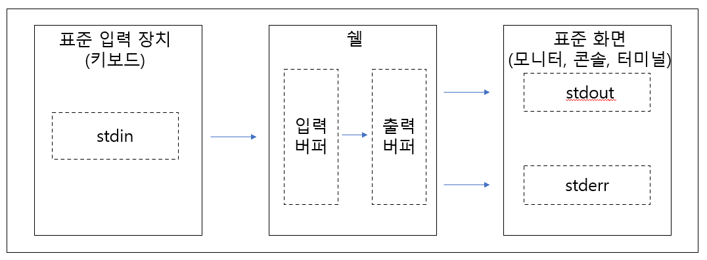
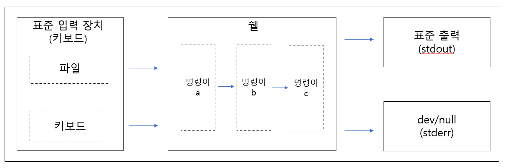
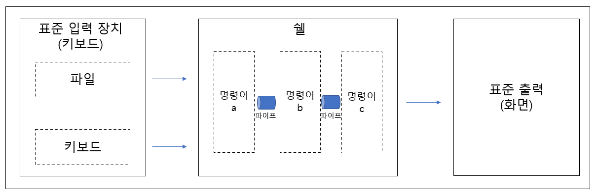
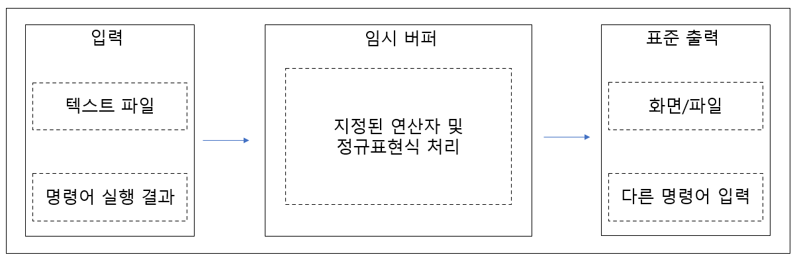
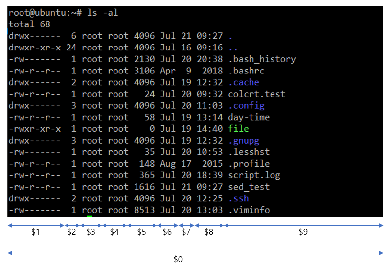

# 3장 UNIX/Linux 기본 명령어와 개념

**기본 리눅스 명령어가 익숙한 독자는 4장으로 가서 쉘 스크립트 작성에 관련된 기본 문법을 숙달하는 것을 추천한다.**

### 3.1 입출력 재지정

|fd|fd 이름|용도|표준 장치|
|:---|:---|:---|:---|
|0|stdin(standard input)|명령어에 입력될 내용을 저장|키보드|
|1|stdout(standard output)|명령어에서 출력될 내용을 저장|화면|
|2|stderr(standard error)|명령어에서 출력될 에러 메시지를 저장|화면|




- 이렇게 키보드 같은 표준 입력 장치가 아닌 파일 등으로 재지정하는 것을 입력 재지정(input redirection)이라고 하고, 명령어의 실행 결과나 에러 메시지 같이 화면에 출력되는 것을 파일 등에 저장하는 것을 출력 재지정(output redirection)이라고 한다.
- 입출력 재지정
    - `<` : 입력 재지정
    - `>` : 출력 재지정
    - fd 번호를 받으시 붙여서 사용한다
    
    |형식|내용|
    |:---|:---|
    |명령어 fd 번호 < 파일|명령어에서 기본 지정된 파일이나 표준 입력 장치가 아닌 재지정된 파일에서 데이터를 입력받는다.|
    |명령어 fd 번호 > 파일|명령어에서 기본 지정된 파일이나 표준 출력 장치가 아닌 재지정된 파일에 데이터를 출력한다.|
    - 입출력 재지정을 사용할 때 fd 번호를 생략할 수 있다.

- 예시
    1. 입력
        
        ```
        명령어 < 파일
        명령어 0< 파일
        $ cat system
        Linux
        $ tr '[A-Z]' '[a-z]' < system
        linux
        ```

    2. 출력
        - `>` 이름이 같은 파일이 있다면 덮어쓰기
        - `>>` 이름이 같은 파일이 있다면 새로운 내용을 추가
        
        ```
        명령어 > 파일
        명령어 1> 파일
        명령어 >> 파일
        명령어 1>> 파일
        $ date > day-time
        $ cat day-time
        Sun Jul 19 13:14:15 UTC 2020
        $ date >> day-time
        $ cat day-time
        Sun Jul 19 13:14:15 UTC 2020
        Sun Jul 19 13:14:29 UTC 2020
        ```

        ```
        명령어 2> 파일
        명령어 2>> 파일
        ```

    3. 출력과 에러 메시지가 동일한 파일에 출력하도록 재지정할 수 있다.
        - 명령어의 중복을 막기 위해 이용할 수 있다.
        - `>&` : 기호 앞에 fd 번호 1은 생략이 가능하지만 기호 뒤에 fd 번호는 생략이 불가함을 기억해야 한다.

### 3.2 파이프 (Pipe)

- 앞의 명령어의 실행 결과가 뒤의 명령어에 입력되도록 입출력을 연결하는 연결하는 역할을 한다.
- 파이프의 역할은 출력 재지정과 유사하다.
    - 출력 재지정의 경우 하드디스크 같은 보조 기억 매체의 입출력 버퍼에 저장하고 재지정된 명령어에 전달하기 때문에 버퍼에 저장하고 처리하는데 시간이 걸린다.
    - 파이프의 경우, 여러 개의 명령어가 파이프로 실행될 때 이들 명령어가 거의 동식에 실행되면서 입출력되는 데이터들이 파이프로 연결되어 처리되므로 상대적으로 처리 시간이 빠른 것이 특징이다.


- 명령어 a의 실행 결과를 명령어 b로 넘겨주고 최종적으로 명령어c에 의해 처리된 결과를 확인할 수 있다.
- 예시
    ```
    $ ls -l /var/log | sort -rk 9
    -rw-rw-r--  1 root      utmp              9984 Jul 19 13:14 wtmp
    drwxr-x---  2 root      adm               4096 Jul 16 09:24 unattended-upgrades
    -rw-------  1 root      root             64064 Jul 16 09:30 tallylog
    -rw-r-----  1 syslog    adm             244407 Jul 19 13:24 syslog
    drwxr-xr-x  2 root      root              4096 Nov 23  2018 lxd
    -rw-rw-r--  1 root      utmp            292292 Jul 19 13:14 lastlog
    drwxr-xr-x  2 landscape landscape         4096 Jul 16 09:36 landscape
    -rw-r-----  1 syslog    adm             151620 Jul 19 12:34 kern.log
    drwxr-sr-x+ 3 root      systemd-journal   4096 Jul 16 09:30 journal
    drwxr-xr-x  3 root      root              4096 Jul 16 09:27 installer
    -rw-r--r--  1 root      root             32032 Jul 16 09:30 faillog
    -rw-r--r--  1 root      root            535179 Jul 16 09:27 dpkg.log
    drwxr-xr-x  2 root      root              4096 Jan 24 11:47 dist-upgrade
    -rw-r--r--  1 root      root             11103 Jul 19 12:35 cloud-init-output.log
    -rw-r--r--  1 syslog    adm             211836 Jul 19 12:35 cloud-init.log
    -rw-rw----  1 root      utmp               384 Jul 19 12:31 btmp
    -rw-r--r--  1 root      root             56751 Feb  3 18:22 bootstrap.log
    -rw-r-----  1 syslog    adm               7084 Jul 19 13:17 auth.log
    drwxr-xr-x  2 root      root              4096 Jul 16 09:27 apt
    -rw-r--r--  1 root      root             27163 Jul 16 09:27 alternatives.log
    ```

### 3.3 UNIX/Linux 시스템 관리를 위한 기본 명령어

- 3.3.1 at 명령어
    - 명령어나 스크립트 파일이 특정 시간에 실행되도록 예약하는 기능을 수행한다.
    - 시스템 사용이 적은 시간 또는 필요한 시간에 지정된 작업을 자동으로 처리하고자 할 때 유용하다.
    - 사용 형식
        ```
        at [옵션] [시간] [날짜] [+증가시간]
        ```
    - 옵션
        
        |구분||설명|
        |:---|:---|:---|
        |옵션|-q queue|queue 이름을 지정한다.|
        ||-m|작업이 완료될 때 상요자에게 메일을 보낸다.|
        ||-f file|file에서 작업 목록을 보여준다.|
        ||-l|예약된 작업 목록을 보여준다.|
        ||-v|작업이 수행될 시간을 보여준다.|
        ||-d|예약된 작업을 삭제한다.|
        |시간|hh:mm|시간:분으로 설정한다.|
        ||am, pm|am, pm을 이용하여 12 단위로 시간을 표시한다.|
        |날짜|yyyy-mm-dd|년-월-일 구성으로 표현한다.|
        ||today, tommorrow|오늘, 내일로 지정할 때 사용한다.|
    - 예제
        - 지정된 시간에 This Time is를 화면에 표시하고 시간을 표시한다.
        - 작업 등록 후 `ctrl + d`를 누르면 편집줄 상태에서 빠져 나오면서 등록이 완료된다.
        ```
        $ at 21:40 2020-07-19
        at> echo "This Time is"
        at> date
        at> <EOT>
        job 1 at Sun Jul 19 21:40:00 2020
        $ at -l
        1       Sun Jul 19 21:40:00 2020 a root     # [작업 번호, 실행 날짜 및 시간, queue 이름, 예약 사용자] 순서
        ```
    - 추가적으로 at 명령어는 /etc/at.allow 와 /etc/at.deny 설정을 기반으로 예약 사용자들을 통제할 수 있다.
    - /etc/at.allow에 등록된 사용자가 at 명령어를 사용할 수 있다.
    - /etc/at.allow가 없으면 /etc/at.deny에 등록되지 않은 사용자만 사용할 수 있다.
    - 두 설정 파일이 없다면 root 사용자만 가능하다.
- 3.3.2 chmod 명령어
    - 파일, 디렉터리, 장치 등의 접근 권한(퍼미션)을 바꾼다.
    - 접근 권한은 소유자, 소유 그룹, 기타 사용자로 나누어 구분된다.
    - 각 항목별로 r, w, x 권한을 지정할 수 있다.
    - 사용 형식
        ```
        chmod [옵션] [퍼미션 값]
        chmod [옵션] [ugao] [+-=] [rwx]
        ```

        |권한 표기|권한|
        |:---|:---|
        |u|소유자|
        |g|소유자가 속한 그룹|
        |o|기타 소유자|
        |a|u, g, o 모두|
        |+|허가 추가|
        |-|허가 삭제|
        |=|옵션 이외는 모두 취소(절대 옵션)|
        |r|읽기 허가|
        |w|쓰기 허가|
        |x|실행 허가|
    - 예시
        ```
        $ ls -al file
        -rwxr-xr-x 1 root root 0 Jul 19 14:40 file
        $ chmod a-r file
        $ ls -al file
        --wx--x--x 1 root root 0 Jul 19 14:40 file
        $ chmod 755 file
        $ ls -al file
        -rwxr-xr-x 1 root root 0 Jul 19 14:40 file
        ```
- 3.3.3 chown 명령어
    - 파일 소유자 및 소유 그룹을 바꾸기 위한 명령으로, 시스템 최고 관리자인 root만이 명령어를 사용할 수 있다.
    - -R 옵션으로 특정 디렉토리에 있는 모든 파일의 접근 권한을 변경할 수 있다.
    - 사용 형식
        ```
        chown [옵션] [소유자].[그룹]
        ```
    - 예시
        ```
        $ chown user01.user01 file
        ```
- 3.3.4 cmp 명령어
    - 파일을 비교하여 서로 다른 부분을 알려주는 명령어로 다음에 살펴볼 diff 명령어와 유사하다.
    - 차이점의 유무만을 나타낸다.
    - 사용 형식
        ```
        cmp [옵션] file1 file2
        ```
    - 옵션
        - -l : 각 파일의 서로 다른 바이트 번호를 나타낸다.
        - -s : 메시지에 의한 표시 대신 차이가 없으면 0, 차이가 있으면 1을 남긴다.
- 3.3.5 col 명령어
    - 텍스트 파일 내 개행(특수) 문자와 공 백 등을 변환하는 필터 역할을 한다.
    - \n\r 문자를 \n 문자로 변환하거나 공백 문자를 탭 문자로 변환할 때 사용한다.
    - 사용 형식
        ```
        col [옵션]
        ```
    - 주요 옵션
        
        |옵션|설명|
        |:---|:---|
        |-b|백스페이스 문자는 출력하지 않고 백스페이스 문자와 연결되는 마지막 문자만 출력한다.|
        |-f|밑줄 속성을 가진 문자열을 변환하지 않는다.|
        |-h|중복되는 공백을 출력하지 않고 탭으로 변환한다.|
        |-x|중복되는 공백 문자를 그대로 둔다.|
        |-l 숫자|버퍼 값을 지정하여 메모리에 상주할 수 있는 최대 줄 수를 지정한다.|
    - 예시
        ```
        # col의 man 페이지를 파일로 변환하여 저장한다.
        $ man col | col > col.man
        ```
    - col을 이용해 개행문자를 정리하는 것도 시스템 관리를 위해 유용하다.
- 3.3.6 colcrt 명령어
    - 밑줄(_)을 감추거나 변환한다.
    - 사용 형식
        ```
        colcrt [옵션]
        ```
    - 주요 옵션
        - `-` : 밑줄 속성이 있는 문자열을 표시하지 않는다.
        - `-2` : 밑줄 속성이 있는 문자열 다음 줄에 하이픈(-)을 포함하여 표시한다.
    - 예시
        ```
        $ cat colcrt.test
        Linux_UNIX_Shell Script
        $ colcrt colcrt.test
        Linux UNIX Shell Script
        -    -
        $ colcrt - colcrt.test
        Linux UNIX Shell Script
        $ colcrt -2 colcrt.test
        
        Linux UNIX Shell Script
            -    -
        ```
- 3.3.7 cp 명령어
    - 특정 파일을 현재 디렉토리나 다른 디렉토리로 복사한다.
    - 사용 형식
        ```
        cp [옵션] 파일명1 파일명2
        ```
    - 주요 옵션
        
        |옵션|설명|
        |:---|:---|
        |-a|원본 파일의 속성, 구조 등을 그대로 유지하면서 복사한다.|
        |-b|복사할 때 같은 이름의 파일이 있으면 백업본을 만든다.|
        |-d|복사할 때 파일이 심볼릭 링크 파일이면 심볼릭 링크의 대상 파일을 복사한다.|
        |-f|복사 대상 파일이 있으면 지우고 복사한다.|
        |-i|복사 시 같은 파일이 있으면 덮어쓸지를 확인한다.|
        |-P|원본 파일의 소유자, 그룹, 권한, 시간 기록을 그대로 복사한다.|
        |-r|디렉터리의 하위 디렉터리의 파일 및 디렉터리까지 복사한다.|
- 3.3.8 cut 명령어
    - 텍스트 파일이나 파이프된 결과 중에 지정된 부분만 표시한다.
    - 시스템 관리 실무에서 awk 명령어와 더불어 텍스트 파일 출력 편집용으로 많이 사용된다.
    - 별도의 구분자 없이 사용했을 때는 바이트 단위로 구분하지만 별도의 구분자를 지정하였을 경우 지정한 구분자를 기준으로 표시한다.
    - 사용 형식
        ```
        cut [옵션]
        ```
    - 주요 옵션
        |옵션|설명|
        |:---|:---|
        |-b|바이트 단위로 나타낸다.|
        |-c|문자 단위로 나타낸다.|
        |-d|기본 필드 구분자인 탭 대신 지정된 구분자를 이용한다.|
        |-f|지정된 필드만 구성하여 표시한다.|
        |-s|필드 구분자에 포함되어 있지 않은 행은 표시하지 않는다.|
    - `-b`, `-c`, `-f` 옵션에서는 숫자 범위를 지정할 수 있다.
        |구분|설명|
        |:---|:---|
        |A|A번째|
        |A-|A번째 부터|
        |A-B|A부터 B까지|
        |-B|B까지|
    - 예시
        ```
        # passwd에서 시스템에 등록되어 있는 계정과 연계된 쉘 부분만 표시한다. 기본 구분자를 콜론으로하여 1번과 7번 필드를 표시한다.
        $ cut -d":" -f1,7 /etc/passwd
        root:/bin/bash
        daemon:/usr/sbin/nologin
        bin:/usr/sbin/nologin
        sys:/usr/sbin/nologin
        sync:/bin/sync
        games:/usr/sbin/nologin
        man:/usr/sbin/nologin
        lp:/usr/sbin/nologin
        mail:/usr/sbin/nologin
        news:/usr/sbin/nologin
        uucp:/usr/sbin/nologin
        proxy:/usr/sbin/nologin
        www-data:/usr/sbin/nologin
        backup:/usr/sbin/nologin
        list:/usr/sbin/nologin
        irc:/usr/sbin/nologin
        gnats:/usr/sbin/nologin
        nobody:/usr/sbin/nologin
        systemd-network:/usr/sbin/nologin
        systemd-resolve:/usr/sbin/nologin
        syslog:/usr/sbin/nologin
        messagebus:/usr/sbin/nologin
        _apt:/usr/sbin/nologin
        lxd:/bin/false
        uuidd:/usr/sbin/nologin
        dnsmasq:/usr/sbin/nologin
        landscape:/usr/sbin/nologin
        pollinate:/bin/false
        sshd:/usr/sbin/nologin
        ubuntu:/bin/bash
        ```
- 3.3.9 date 명령어
    - 시스템의 날짜와 시간을 알려주거나 설정한다.
    - 옵션 없이 사용하면 시스템의 현재 시간과 날짜를 표시하고, 특정 형식을 지정하면 형식에 맞춰서 시간이 표시된다.
    - 사용 형식
        ```
        date [옵션] [+형식]
        ```
    - 주요 옵션
        
        |옵션|설명|
        |:---|:---|
        |-d|지정된 날짜를 표시한다.|
        |-f|지정한 파일에서 각 행에 대한 날짜를 표시한다.|
        |-r|지정한 파일이 마지막 수정된 날짜를 표시한다.|
        |-s|지정된 값으로 시간을 맞춘다.|
    - 형식
    
        |형식|설명|
        |:---|:---|
        |%d|월의 일|
        |%j|년의 일|
        |%k|24시간의 시간|
        |%l|12시간의 시간|
        |%m|년의 월|
        |%n|새로운 줄 입력|
        |%p|AM / PM|
- 3.3.10 df 명령어
    - 파일 시스템의 디스크 공간을 확인해서 표시한다.
    - 사용 형식
        ```
        df [옵션]
        ```
    - 주요 옵션

        |옵션|설명|
        |:---|:---|
        |-a|모든 파일 시스템을 표시한다.|
        |-B|지정된 크기를 블록 단위로 정하여 용량을 표시한다.|
        |-h|사람이 인지하기 좋은 kilo, mega, giga 단위로 표시한다.|
        |-H|사람이 인지하기 좋도록 1KB를 1000단위로 산출하여 표시한다.|
        |-i|아이노드의 남은 공간, 사용 공간, 사용율 정보를 표시한다.|
        |-k|1KB 단위로 표시한다.|
- 3.3.11 diff 명령어
    - 파일을 비교하여 다른 부분을 표시한다.
    - 사용 형식
        ```
        diff [옵션] file1 file2
        ```
    - 주요 옵션
    
        |옵션|설명|
        |:---|:---|
        |-a|모든 파일을 텍스트 파일로 취금하여 행간 비교를 한다.|
        |-b|중복된 공백은 무시한다.|
        |-i|대소문자를 구별하지 않는다.|
        |-H|큰 파일을 빠르게 처리하기 위해 사용한다.|
        |-l|pr 명령어를 통해 페이지를 출력한다.|
        |-L|파일 이름 대신 지정된 라벨을 사용한다.|
        |-N|존재하지 않는 파일이면 빈 파일로 인식한다.|
        |-r|비교 대상의 하위 디렉토리의 파일까지 비교한다.|
        |-s|비교하는 대상의 파일이 서로 같을 경우 비교 결과가 같음을 출력한다.|
        |-w|각 줄을 비교할 때 공백은 무시한다.|
- 3.3.12 domainname 명령어
    - 운영체제에 설정된 도메인명 정보를 확인한다.
    - 사용 형식
        ```
        domainname [옵션] 도메인명
        ```
    - 주요 옵션

        |옵션|설명|
        |:---|:---|
        |-s|간단한 호스트명을 출력한다.|
        |-a|별명을 출력한다.|
        |-i|호스트 IP 주소를 출력한다.|
        |-f|전체 호스트명을 출력한다.|
        |-d|DNS 도메인명을 출력한다.|
    - 예시
        - `domainname -f`를 사용하면 `hostname` 명령과 동일한 결과를 확인할 수 있다.
        ```
        $ domainname
        $ domainname -f
        $ domainname shell.co.kr
        $ domainname
        ```
- 3.3.13 du 명령어
    - 현재 디렉터리의 사용량을 표시한다.
    - 옵션 없이 사용하면 현재 디렉터리의 크기를 MB 단위로 출력한다.
    - 사용 형식
        ```
        du [옵션]
        ```
    - 주요 옵션

        |옵션|설명|
        |:---|:---|
        |-a|현재 디렉터리의 모든 파일과 하부 디렉터리의 사용량을 출력한다.|
        |-b|바이트 크기로 사용량을 출력한다.|
        |-h|사용자가 보기 쉬운 형태로 정보를 표시한다.|
        |-k|사용량을 1KB 형태로 표시한다.|
        |-s|간단힌 총 사용량만 표시한다.|
- 3.3.14 echo 명령어
    - 지정된 문자열을 출력한다.
    - 현재 쉘의 환경 변수를 확인할 때도 활용하며, 쉘 스크립트 작성 시 각종 문자나 기호를 출력하거나 재지정을 통해 로그를 만들 때에도 많이 활용한다.
    - 사용 형식
        ```
        echo [옵션] [출력 문자열]
        ```
    - 주요 옵션
        - `-n` : 화면의 커서를 다음 줄로 옮기는 역할을 한다.
        - `-e` : `\(옵션)`에 설정된 기능을 수행한다.
            - `\a` : 경고음(alert) 소리를 낸다.
            - `\b` : 백스페이스
            - `\c` : 마지막 개행 문자를 사용하지 않는다.
            - `\n` : 개행 문자를 출력한다.
            - `\t` : 수평 탭
            - `\v` : 수직 탭
            - `\\` : 백슬래시
    - 예시
        ```
        $ set
        $ echo $USER
        root
        $ echo Shell Script
        Shell Script
        $ echo -n Shell Script
        Shell Script$ echo -e "\a Shell Script"
         Shell Script
        ```
- 3.3.15 find 명령어
    - 운영체제에서 조건에 맞는 파일을 찾고자 할 때 사용한다.
    - 사용 형식
        ```
        find [경로] [조건식] [액션]
        ```
    - 주요 조건식과 액션
        - 조건식
            - `-name` : 파일명과 일치하는 파일을 찾을 수 있도록 지정한다.
            - `-atime` : 지정된 날짜 이전에 액세스된 파일을 찾는다.
            - `-ctime` : 지정된 날짜 이전에 퍼미션이 변경된 파일을 찾는다.
            - `-mtime` : 지정된 날짜 이전에 파일 수정 날짜가 변경된 파일을 찾는다.
            - `-size` : 파일의 크기가 지정된 숫자만큼의 블록인 파일을 찾는다. 바이트 단위로 검색을 하려면 지정된 숫자 뒤에 c를 붙인다.
            - `-group` : 지정된 그룹 소유의 파일을 찾는다.
            - `-user` : 지정된 유저 소유의 파일을 찾는다.
            - `-type` : 파일의 종류가 어떤 형태인지 검색한다.(일반파일(f), 블록 디바이스(b), 캐릭터 디바이스(c), 심볼릭 링크(l), 디렉토리(d))
            - `-perm` : 지정된 퍼미션이 부여된 파일을 찾는다.
        - 액션 
            - `-delete` : 검색된 파일을 삭제한다.
            - `-exec 명령어;` : 검색 후 지정된 명령어를 실행한다.
            - `-print` : 검색된 파일들의 전체 경로를 표준 출력으로 출력한다.
- 3.3.16 free 명령어
    - 운영체제에서 사용하는 메모리와 사용하지 않는 메모리를 물리적 메모리와 스왑 메모리 등으로 구분하여 전체적인 현황을 살펴볼 때 유용하다.
    - 사용 형식
        ```
        free [옵션]
        ```
    - 주요 옵션
    
        |옵션|설명|
        |:---|:---|
        |-b|메모리의 양을 Byte로 표시한다.|
        |-k|메모리의 양을 KB 단위로 표시한다.|
        |-m|메모리의 양을 MB 단위로 표시한다.|
        |-t|총계가 포함된 줄을 출력한다.|
        |-s|지정된 초마다 출력하게 한다.|
- 3.3.17 ftp 명령어
    - FTP(File Transfer Protocol) : 네트워크상에서 파일을 서로 주고받을 수 있도록 하는 서비스 프로토콜
    - 사용 형식
        ```
        ftp [옵션] 호스트 네임 / 주소
        ```
    - 주요 옵션과 내장 명령엉
        - 주요 옵션
            - `-i` : 여러 개의 파일 전송 중 ftp 프롬프트의 상호작용을 비활성화 한다.
            - `-t` : 패킷 추적을 가능하도록 설정한다.
        - 내장 명령어
            - `ascii` : 주받는 파일을 텍스트 형식으로 설정한다.
            - `binary` : 주고받는 파일을 바이너리 형식 파일로 설정한다.
            - `case` : 파일의 이름을 대소문자 구별하지 않도록 설정한다.
            - `ls(dir)` : 서버의 파일 및 디렉터리 목록을 나열한다.
            - `cd` : 서버의 디렉터리로 이동한다.
            - `lcd` : 로컬(자신의 시스템)의 디렉토리를 변경한다.
            - `get` : 서버에서 하나의 파일을 다운로드한다.
            - `mget` : 서버에서 여러 개의 파일을 다운로드한다.
            - `put` : 로컬(자신의 시스템)에 있는 하나의 파일을 서버로 업로드한다.
            - `mput` : 로컬(자신의 시스템)에 있는 여러 개의 파일을 서버로 업로드한다.
            - `delete` : 서버에서 하나의 파일을 삭제한다.
            - `mdelete` : 서버에서 여러 개의 파일을 삭제한다.
            - `mkdir` : 서버에 새로운 디렉토리를 만든다.
            - `rmdir` : 서버에 있는 디렉토리를 삭제한다.
            - `!명령어` : 로컬(자신의 시스템)의 명령어를 실행한다.
            - `quit / bye` : ftp를 종료한다.
    - 주의
        - ubuntu에서 ftp 서버로 vsftpd를 기본적으로 사용한다.
        - root 사용자로는 로그인할 수 없게 되어 있다.(설정할 수 있지만 권장하지 않는다.)
        ```
        $ sudo apt install -y vsftpd
        $ sudo service vsftpd status
        ```
    - 예시
        ```
        # IP로 ftp 서버 접속
        # open 명령어와 마찬가지 이다.
        $ ftp 192.168.56.102
        ftp> bye
        $ ftp
        ftp> open 192.168.56.102
        ```
- 3.3.18 ifconfig 명령어
    - 운영체제의 네트워크 인터페이스의 설정을 확인 및 변경한다.
    - 사용 형식
        ```
        ifconfig [네트워크 인터페이스] [타임] [옵션] [설정값]
        ```
    - `-a` 옵션으로 모든 네트워크 인터페이스에 설정되어 있는 정보를 확인할 수 있다.
    - 특정 네트워크 인터페이스에서 IP를 설정하는 방법
        ```
        $ ifconfig echo 192.168.0.100 netmask 255.255.255.0
        ```
    - 대부분의 UNIX, Linux에서는 IP 변경 등 주요 정보 설정을 처리하는 자동화된 프로그램이나 스크립트를 제공한다.
    - 콘솔 접속을 통해 IP를 설정해야할 때 ifconfig 명령어를 유용하게 사용할 수 있다.
    - 이외에 `ip addr` 명령도 존재한다.
- 3.3.19 grep 명령어
    - 텍스트 형식으로 된 파일의 내용이나 명령어의 실행 결과를 특정 문자나 단어로 검색한다.
    - 단독으로 쓰이기보다는 다른 명령어에 파이프 형태로 결합하여 사용된다.
    - 단독으로 사용될 때에는 텍스트 파일 또는 결과의 특정 문자나 단어가 포함된 행이 출력된다.
    - 기본적으로 검색 대상 문자의 대소문자를 구별하여 검색한다.
    - 사용 형식
        ```
        grep [옵션] [패턴]
        ```
    - 옵션과 정규 표현식
        - 옵션
            - `-c` : 해당 패턴이 포함된 행의 개수를 출력한다.
            - `-i` : 패턴의 대소문자를 구별 없이 검색한다.
            - `-n` : 해당 패턴이 포함된 행의 행 번호를 포함하여 출력한다.
            - `-v` : 해당 패턴을 제외하고 출력한다.
        - 정규 표현식
            - `^` : 행의 첫 시작을 의미한다.
            - `$` : 행의 끝을 의미한다.
            - `.` : 한 글자를 의미한다.
            - `*` : 문자열을 의미한다.
            - `[]` : [] 안의 문자열 중 하나를 선택한다.
            - `[^]` : 정규표현식 []와 반대의 개념으로 [^] 안의 문자열을 제외한다.
            - `\` : 특수 문자를 문자로 인식한다.
- 3.3.20 logger 명령어
    - 운영체제의 주요 로그 저장 파일(/var/log/messages)에 메시지를 저장한다.(ubuntu 16.x는 syslog에 저장된다.)
    - SMS나 ESM 등 통합관제체계를 운용하는 곳에서 점검 결과 및 메시지를 연돌시킬 때 유용하게 사용된다.
    - 사용 형식
        ```
        logger [옵션] [메시지]
        ```
    - 주요 옵션
        
        |옵션|설명|
        |:---|:---|
        |-f|파일에 로그를 기록한다.|
        |-i|작성되는 로그마다 프로세스 ID를 포함한다.|
        |-p|우선권이 있는 메시지를 지정한다.|
    - 예제
        ```
        $ logger -i `date`Shell Scripting!
        $ tail /var/log/syslog
        Jul 20 12:56:50 ubuntu systemd-networkd[682]: enp0s8: DHCP: No routes received from DHCP server: No data available
        Jul 20 12:56:50 ubuntu systemd-timesyncd[495]: Network configuration changed, trying to establish connection.
        Jul 20 12:56:50 ubuntu systemd-timesyncd[495]: Synchronized to time server 91.189.89.199:123 (ntp.ubuntu.com).
        Jul 20 13:01:49 ubuntu systemd-timesyncd[495]: Network configuration changed, trying to establish connection.
        Jul 20 13:01:49 ubuntu systemd-networkd[682]: enp0s8: DHCP: No routes received from DHCP server: No data available
        Jul 20 13:01:49 ubuntu systemd-timesyncd[495]: Synchronized to time server 91.189.89.199:123 (ntp.ubuntu.com).
        Jul 20 13:06:40 ubuntu root[4043]: Mon Jul 20 13:06:40 UTC 2020Shell Scripting!
        ```
- 3.3.21 lsof 명령어
    - 시스템에서 열린 파일 목록을 알려주고 사용하는 프로세스, 디바이스 정보, 파일의 종류 등을 표시한다.
    - 사용 형식
        ```
        lsof [옵션]
        ```
    - 주요 옵션
        - `-u` : 사용자를 지정하여 출력한다.
        - `-i` : 특정 포트를 사용하는 프로세스를 출력한다.
            - `lsof -i TCP:80`
            - `lsof -i TCP:22-1024`
        - `-c` : 특정 명령어가 사용하는 프로세스를 출력한다.
            - `lsof -c httpd`
        - `+D` : 지정된 디렉터리 하위에 열려 있는 프로세스를 출력한다.
            - `lsof +D /home/ubuntu`
- 3.3.22 netstat 명령어
    - 현재 시스템에 연결되어 있는 네트워크 연결 상태 및 포트 정보를 표시한다.
    - 사용 형식
        ```
        netstat [옵션]
        ```
    - 주요 옵션
    
        |옵션|설명|
        |:---|:---|
        |-r|커널의 라우팅 테이블 정보를 출력한다.|
        |-i|네트워크 인터페이스 테이블 정보를 출력한다.|
        |-g|멀티캐스트 그룹 정보를 출력한다.|
        |-s|네트워크 통계 요약을 출력한다.|
        |-M|매스커레이드된 연결 목록을 출력한다.|
        |-v|상세한 정보를 출력한다.|
        |-n|숫자 형태의 IP 주소로 출력한다.|
        |-c|매초마다 정보를 최신화하여 출력한다.|
        |-p|소켓을 사용하는 프로글매의 PID를 출력한다.|
        |-l|LISTENING 상태의 소캣을 출력한다.|
    - 예시
        ```
        $ netstat
        $ netstat -anlp
        $ netstat -nr
        ```
- 3.3.23 nl 명령어
    - 텍스트 형태의 파일을 읽어 행 번호를 부여한다.
    - 사용 형식
        ```
        nl [옵션] [텍스트 형태 파일]
        ```
    - 주요 옵션
        
        |옵션|설명|
        |:---|:---|
        |-b|본문에 번호를 붙이는 데 스타일을 사용한다.|
        |-d|논리적 페이지를 구분한다.|
        |-f|꼬리말에 번호를 붙인다.|
        |-h|머리말에 번호를 붙인다.|
        |-i|각 줄의 번호를 증가시킨다.|
        |-l|지정된 숫자만큼의 줄은 하나로 취급한다.|
    - 예시
        ```
        $ nl /etc/passwd
            1  root:x:0:0:root:/root:/bin/bash
            2  daemon:x:1:1:daemon:/usr/sbin:/usr/sbin/nologin
            3  bin:x:2:2:bin:/bin:/usr/sbin/nologin
            4  sys:x:3:3:sys:/dev:/usr/sbin/nologin
            5  sync:x:4:65534:sync:/bin:/bin/sync
            6  games:x:5:60:games:/usr/games:/usr/sbin/nologin
            7  man:x:6:12:man:/var/cache/man:/usr/sbin/nologin
            8  lp:x:7:7:lp:/var/spool/lpd:/usr/sbin/nologin
            9  mail:x:8:8:mail:/var/mail:/usr/sbin/nologin
            10  news:x:9:9:news:/var/spool/news:/usr/sbin/nologin
            11  uucp:x:10:10:uucp:/var/spool/uucp:/usr/sbin/nologin
            12  proxy:x:13:13:proxy:/bin:/usr/sbin/nologin
            13  www-data:x:33:33:www-data:/var/www:/usr/sbin/nologin
            14  backup:x:34:34:backup:/var/backups:/usr/sbin/nologin
            15  list:x:38:38:Mailing List Manager:/var/list:/usr/sbin/nologin
            16  irc:x:39:39:ircd:/var/run/ircd:/usr/sbin/nologin
            17  gnats:x:41:41:Gnats Bug-Reporting System (admin):/var/lib/gnats:/usr/sbin/nologin
            18  nobody:x:65534:65534:nobody:/nonexistent:/usr/sbin/nologin
            19  systemd-network:x:100:102:systemd Network Management,,,:/run/systemd/netif:/usr/sbin/nologin
            20  systemd-resolve:x:101:103:systemd Resolver,,,:/run/systemd/resolve:/usr/sbin/nologin
            21  syslog:x:102:106::/home/syslog:/usr/sbin/nologin
            22  messagebus:x:103:107::/nonexistent:/usr/sbin/nologin
            23  _apt:x:104:65534::/nonexistent:/usr/sbin/nologin
            24  lxd:x:105:65534::/var/lib/lxd/:/bin/false
            25  uuidd:x:106:110::/run/uuidd:/usr/sbin/nologin
            26  dnsmasq:x:107:65534:dnsmasq,,,:/var/lib/misc:/usr/sbin/nologin
            27  landscape:x:108:112::/var/lib/landscape:/usr/sbin/nologin
            28  pollinate:x:109:1::/var/cache/pollinate:/bin/false
            29  sshd:x:110:65534::/run/sshd:/usr/sbin/nologin
            30  ubuntu:x:1000:1000:ubuntu:/home/ubuntu:/bin/bash
            31  ftp:x:111:113:ftp daemon,,,:/srv/ftp:/usr/sbin/nologin
        ```
- 3.3.24 ntpdate 명령어
    - 지정된 time 서버로부터 시간 정보를 동기화시킨다.
    - 사용 형식
        ```
        ntpdate [옵션] [time 서버 주소]
        ```
    - 주요 옵션
    
        |옵션|설명|
        |:---|:---|
        |-d|시간 동기화 실패 시 원인을 위해 디버깅을 할 때 사용한다.|
        |-q|시스템의 시간을 설정하지 않고 시간 정보만 확인한다.|
        |-s|표준 시간 정보를 시스템(syslog)에 전달한다.|
        |-t|timeout 대기 시간을 설정한다.|
        |-v|상세 정보를 출력한다.|
    - 예시
        ```
        $ ntpdate time.bora.net
        20 Jul 17:52:10 ntpdate[1443]: adjust time server 203.248.240.140 offset 0.043376 sec
        $ ntpdate -d time.bora.net
        20 Jul 17:52:23 ntpdate[1444]: ntpdate 4.2.8p10@1.3728-o (1)
        Looking for host time.bora.net and service ntp
        203.248.240.140 reversed to time.bora.net
        host found : time.bora.net
        transmit(203.248.240.140)
        receive(203.248.240.140)
        transmit(203.248.240.140)
        receive(203.248.240.140)
        transmit(203.248.240.140)
        receive(203.248.240.140)
        transmit(203.248.240.140)
        receive(203.248.240.140)
        server 203.248.240.140, port 123
        stratum 3, precision -17, leap 00, trust 000
        refid [203.248.240.140], delay 0.03200, dispersion 0.00291
        transmitted 4, in filter 4
        reference time:    e2c057b4.152fd000  Mon, Jul 20 2020 17:49:40.082
        originate timestamp: e2c0585d.e263a000  Mon, Jul 20 2020 17:52:29.884
        transmit timestamp:  e2c0585d.d8cbed43  Mon, Jul 20 2020 17:52:29.846
        filter delay:  0.03258  0.04349  0.04285  0.03200  0.00000  0.00000  0.00000  0.00000
        filter offset: 0.036950 0.031069 0.029500 0.034231 0.000000 0.000000 0.000000 0.000000
        delay 0.03200, dispersion 0.00291
        offset 0.034231

        20 Jul 17:52:29 ntpdate[1444]: adjust time server 203.248.240.140 offset 0.034231 sec
        ```
- 3.3.25 ping 명령어
    - ICMP 프로토콜을 이용하여 네트워크에 연결된 호스트의 연결 상태를 확인하고, 호스트 간에 패킷이 왕복된 시간을 측정하여 표시한다.
    - 사용 형식
        ```
        ping [옵션] [호스트 주소]
        ```
    - 주요 옵션
        - `-b` : 브로드캐스트(boardcast) 주소로 패킷을 보낸다.
        - `-c` : 지정된 숫자만큼만 패킷을 보낸다.
        - `-i` : 지정된 간격으로 패킷을 보낸다.
- 3.3.26 pmap 명령어
    - 시스템의 프로세스 ID를 기준으로 메모리 맵 정보를 출력한다.
    - 사용 형식
        ```
        pmap [옵션] [PID]
        ```
    - 주요 옵션
        - `-x` : 확장된 형식으로 출력한다.
        - `-d` : 디바이스 형식으로 출력한다.
        - `-q` : 간단한 요약 정보로 출력한다.
    - 사용 예시
        ```
        $ ps aux
        USER       PID %CPU %MEM    VSZ   RSS TTY      STAT START   TIME COMMAND
        root         1  0.2  0.8  77792  8816 ?        Ss   17:43   0:03 /sbin/init maybe-ubiquity
        root         2  0.0  0.0      0     0 ?        S    17:43   0:00 [kthreadd]
        root         4  0.0  0.0      0     0 ?        I<   17:43   0:00 [kworker/0:0H]
        root         5  0.0  0.0      0     0 ?        I    17:43   0:00 [kworker/u2:0]
        root         6  0.0  0.0      0     0 ?        I<   17:43   0:00 [mm_percpu_wq]
        root         7  0.0  0.0      0     0 ?        S    17:43   0:00 [ksoftirqd/0]
        root         8  0.0  0.0      0     0 ?        I    17:43   0:00 [rcu_sched]
        root         9  0.0  0.0      0     0 ?        I    17:43   0:00 [rcu_bh]
        root        10  0.0  0.0      0     0 ?        S    17:43   0:00 [migration/0]
        root        11  0.0  0.0      0     0 ?        S    17:43   0:00 [watchdog/0]
        root        12  0.0  0.0      0     0 ?        S    17:43   0:00 [cpuhp/0]
        root        13  0.0  0.0      0     0 ?        S    17:43   0:00 [kdevtmpfs]
        root        14  0.0  0.0      0     0 ?        I<   17:43   0:00 [netns]
        root        15  0.0  0.0      0     0 ?        S    17:43   0:00 [rcu_tasks_kthre]
        root        16  0.0  0.0      0     0 ?        S    17:43   0:00 [kauditd]
        root        17  0.0  0.0      0     0 ?        S    17:43   0:00 [khungtaskd]
        root        18  0.0  0.0      0     0 ?        S    17:43   0:00 [oom_reaper]
        root        19  0.0  0.0      0     0 ?        I<   17:43   0:00 [writeback]
        root        20  0.0  0.0      0     0 ?        S    17:43   0:00 [kcompactd0]
        root        21  0.0  0.0      0     0 ?        SN   17:43   0:00 [ksmd]
        root        22  0.0  0.0      0     0 ?        SN   17:43   0:00 [khugepaged]
        root        23  0.0  0.0      0     0 ?        I<   17:43   0:00 [crypto]
        root        24  0.0  0.0      0     0 ?        I<   17:43   0:00 [kintegrityd]
        root        25  0.0  0.0      0     0 ?        I<   17:43   0:00 [kblockd]
        root        26  0.0  0.0      0     0 ?        I<   17:43   0:00 [ata_sff]
        root        27  0.0  0.0      0     0 ?        I<   17:43   0:00 [md]
        root        28  0.0  0.0      0     0 ?        I<   17:43   0:00 [edac-poller]
        root        29  0.0  0.0      0     0 ?        I<   17:43   0:00 [devfreq_wq]
        root        30  0.0  0.0      0     0 ?        I<   17:43   0:00 [watchdogd]
        root        31  0.0  0.0      0     0 ?        I    17:43   0:00 [kworker/u2:1]
        root        32  0.1  0.0      0     0 ?        I    17:43   0:02 [kworker/0:1]
        root        34  0.0  0.0      0     0 ?        S    17:43   0:00 [kswapd0]
        root        35  0.0  0.0      0     0 ?        I<   17:43   0:00 [kworker/u3:0]
        root        36  0.0  0.0      0     0 ?        S    17:43   0:00 [ecryptfs-kthrea]
        root        78  0.0  0.0      0     0 ?        I<   17:43   0:00 [kthrotld]
        root        79  0.0  0.0      0     0 ?        I<   17:43   0:00 [acpi_thermal_pm]
        root        80  0.0  0.0      0     0 ?        S    17:43   0:00 [scsi_eh_0]
        root        81  0.0  0.0      0     0 ?        I<   17:43   0:00 [scsi_tmf_0]
        root        82  0.0  0.0      0     0 ?        S    17:43   0:00 [scsi_eh_1]
        root        83  0.0  0.0      0     0 ?        I<   17:43   0:00 [scsi_tmf_1]
        root        84  0.0  0.0      0     0 ?        I    17:43   0:00 [kworker/u2:2]
        root        89  0.0  0.0      0     0 ?        I<   17:43   0:00 [ipv6_addrconf]
        root        98  0.0  0.0      0     0 ?        I<   17:43   0:00 [kstrp]
        root       115  0.0  0.0      0     0 ?        I<   17:43   0:00 [charger_manager]
        root       152  0.0  0.0      0     0 ?        I    17:43   0:00 [kworker/0:2]
        root       203  0.0  0.0      0     0 ?        S    17:43   0:00 [scsi_eh_2]
        root       204  0.0  0.0      0     0 ?        I<   17:43   0:00 [scsi_tmf_2]
        root       205  0.0  0.0      0     0 ?        I<   17:43   0:00 [ttm_swap]
        root       206  0.0  0.0      0     0 ?        S    17:43   0:00 [irq/18-vmwgfx]
        root       208  0.0  0.0      0     0 ?        I<   17:43   0:00 [kworker/0:1H]
        root       274  0.0  0.0      0     0 ?        I<   17:43   0:00 [raid5wq]
        root       327  0.0  0.0      0     0 ?        S    17:43   0:00 [jbd2/sda2-8]
        root       328  0.0  0.0      0     0 ?        I<   17:43   0:00 [ext4-rsv-conver]
        root       394  0.0  1.3  78492 13172 ?        S<s  17:43   0:00 /lib/systemd/systemd-journald
        root       410  0.0  0.1  97708  1824 ?        Ss   17:43   0:00 /sbin/lvmetad -f
        root       414  0.0  0.0      0     0 ?        I<   17:43   0:00 [iscsi_eh]
        root       422  0.0  0.4  45560  4508 ?        Ss   17:43   0:00 /lib/systemd/systemd-udevd
        root       424  0.0  0.0      0     0 ?        I<   17:43   0:00 [ib-comp-wq]
        root       425  0.0  0.0      0     0 ?        I<   17:43   0:00 [ib-comp-unb-wq]
        root       426  0.0  0.0      0     0 ?        I<   17:43   0:00 [ib_mcast]
        root       427  0.0  0.0      0     0 ?        I<   17:43   0:00 [ib_nl_sa_wq]
        root       442  0.0  0.0      0     0 ?        I<   17:43   0:00 [rdma_cm]
        systemd+   485  0.0  0.3 141952  3316 ?        Ssl  17:43   0:00 /lib/systemd/systemd-timesyncd
        root       488  0.0  0.0      0     0 ?        S<   17:43   0:00 [loop0]
        root       492  0.0  0.0      0     0 ?        S<   17:43   0:00 [loop1]
        root       609  0.0  0.0      0     0 ?        I<   17:43   0:00 [iprt-VBoxWQueue]
        systemd+   695  0.0  0.5  88392  5944 ?        Ss   17:43   0:00 /lib/systemd/systemd-networkd
        systemd+   696  0.0  0.5  70656  5204 ?        Ss   17:43   0:00 /lib/systemd/systemd-resolved
        syslog     783  0.0  0.4 263040  4404 ?        Ssl  17:43   0:00 /usr/sbin/rsyslogd -n
        daemon     784  0.0  0.2  28332  2352 ?        Ss   17:43   0:00 /usr/sbin/atd -f
        root       785  0.0  0.1  95540  1600 ?        Ssl  17:43   0:00 /usr/bin/lxcfs /var/lib/lxcfs/
        root       790  0.0  1.7 169100 17236 ?        Ssl  17:43   0:00 /usr/bin/python3 /usr/bin/networkd-dispatcher --run
        root       796  0.0  0.3  30028  3240 ?        Ss   17:43   0:00 /usr/sbin/cron -f
        root       804  0.0  0.5  70608  6012 ?        Ss   17:43   0:00 /lib/systemd/systemd-logind
        root       805  0.0  0.6 286256  6792 ?        Ssl  17:43   0:00 /usr/lib/accountsservice/accounts-daemon
        message+   806  0.0  0.4  50056  4576 ?        Ss   17:43   0:00 /usr/bin/dbus-daemon --system --address=systemd: --
        root       826  0.1  2.5 562936 26108 ?        Ssl  17:43   0:01 /usr/lib/snapd/snapd
        root       827  0.0  0.5  72300  5724 ?        Ss   17:43   0:00 /usr/sbin/sshd -D
        root       828  0.0  0.2  29148  2956 ?        Ss   17:43   0:00 /usr/sbin/vsftpd /etc/vsftpd.conf
        root       833  0.0  0.6 288884  6460 ?        Ssl  17:43   0:00 /usr/lib/policykit-1/polkitd --no-debug
        root       834  0.0  1.9 185944 20112 ?        Ssl  17:43   0:00 /usr/bin/python3 /usr/share/unattended-upgrades/una
        root       843  0.0  0.3  78768  3612 tty1     Ss   17:43   0:00 /bin/login -p --
        root      1170  0.0  0.6  76684  6924 ?        Ss   17:44   0:00 /lib/systemd/systemd --user
        root      1171  0.0  0.2 109476  2384 ?        S    17:44   0:00 (sd-pam)
        root      1191  0.0  0.4  21360  5028 tty1     S+   17:44   0:00 -bash
        root      1212  0.0  0.6 105696  6928 ?        Ss   17:44   0:00 sshd: root@pts/0
        root      1281  0.0  0.5  21492  5380 pts/0    Ss   17:45   0:00 -bash
        root      1471  0.0  0.3  38376  3648 pts/0    R+   18:06   0:00 ps aux
        $ pmap -x 783
        783:   /usr/sbin/rsyslogd -n
        Address           Kbytes     RSS   Dirty Mode  Mapping
        000055f9fa987000     624     600       0 r-x-- rsyslogd
        000055f9fa987000       0       0       0 r-x-- rsyslogd
        000055f9fac23000      12      12      12 r---- rsyslogd
        000055f9fac23000       0       0       0 r---- rsyslogd
        000055f9fac26000      28      28      28 rw--- rsyslogd
        000055f9fac26000       0       0       0 rw--- rsyslogd
        000055f9fac2d000       4       4       4 rw---   [ anon ]
        000055f9fac2d000       0       0       0 rw---   [ anon ]
        000055f9fbc07000     248     160     160 rw---   [ anon ]
        000055f9fbc07000       0       0       0 rw---   [ anon ]
        00007f42e4000000     132     124     124 rw---   [ anon ]
        00007f42e4000000       0       0       0 rw---   [ anon ]
        00007f42e4021000   65404       0       0 -----   [ anon ]
        00007f42e4021000       0       0       0 -----   [ anon ]
        00007f42e8000000     132     128     128 rw---   [ anon ]
        00007f42e8000000       0       0       0 rw---   [ anon ]
        00007f42e8021000   65404       0       0 -----   [ anon ]
        00007f42e8021000       0       0       0 -----   [ anon ]
        00007f42ec000000     336     336     336 rw---   [ anon ]
        00007f42ec000000       0       0       0 rw---   [ anon ]
        00007f42ec054000   65200       0       0 -----   [ anon ]
        00007f42ec054000       0       0       0 -----   [ anon ]
        00007f42f275b000       4       0       0 -----   [ anon ]
        00007f42f275b000       0       0       0 -----   [ anon ]
        00007f42f275c000    8192      24      24 rw---   [ anon ]
        00007f42f275c000       0       0       0 rw---   [ anon ]
        00007f42f2f5c000       4       0       0 -----   [ anon ]
        00007f42f2f5c000       0       0       0 -----   [ anon ]
        00007f42f2f5d000    4096      24      24 rw---   [ anon ]
        00007f42f2f5d000       0       0       0 rw---   [ anon ]
        00007f42f335d000       4       0       0 -----   [ anon ]
        00007f42f335d000       0       0       0 -----   [ anon ]
        00007f42f335e000    4096      24      24 rw---   [ anon ]
        00007f42f335e000       0       0       0 rw---   [ anon ]
        00007f42f375e000     240      64       0 r-x-- libnss_systemd.so.2
        00007f42f375e000       0       0       0 r-x-- libnss_systemd.so.2
        00007f42f379a000    2044       0       0 ----- libnss_systemd.so.2
        00007f42f379a000       0       0       0 ----- libnss_systemd.so.2
        00007f42f3999000      12      12      12 r---- libnss_systemd.so.2
        00007f42f3999000       0       0       0 r---- libnss_systemd.so.2
        00007f42f399c000       4       4       4 rw--- libnss_systemd.so.2
        00007f42f399c000       0       0       0 rw--- libnss_systemd.so.2
        00007f42f399d000      92      64       0 r-x-- libnsl-2.27.so
        00007f42f399d000       0       0       0 r-x-- libnsl-2.27.so
        00007f42f39b4000    2044       0       0 ----- libnsl-2.27.so
        00007f42f39b4000       0       0       0 ----- libnsl-2.27.so
        00007f42f3bb3000       4       4       4 r---- libnsl-2.27.so
        00007f42f3bb3000       0       0       0 r---- libnsl-2.27.so
        00007f42f3bb4000       4       4       4 rw--- libnsl-2.27.so
        00007f42f3bb4000       0       0       0 rw--- libnsl-2.27.so
        00007f42f3bb5000       8       0       0 rw---   [ anon ]
        00007f42f3bb5000       0       0       0 rw---   [ anon ]
        00007f42f3bb7000      44      44       0 r-x-- libnss_nis-2.27.so
        00007f42f3bb7000       0       0       0 r-x-- libnss_nis-2.27.so
        00007f42f3bc2000    2044       0       0 ----- libnss_nis-2.27.so
        00007f42f3bc2000       0       0       0 ----- libnss_nis-2.27.so
        00007f42f3dc1000       4       4       4 r---- libnss_nis-2.27.so
        00007f42f3dc1000       0       0       0 r---- libnss_nis-2.27.so
        00007f42f3dc2000       4       4       4 rw--- libnss_nis-2.27.so
        00007f42f3dc2000       0       0       0 rw--- libnss_nis-2.27.so
        00007f42f3dc3000      32      32       0 r-x-- libnss_compat-2.27.so
        00007f42f3dc3000       0       0       0 r-x-- libnss_compat-2.27.so
        00007f42f3dcb000    2048       0       0 ----- libnss_compat-2.27.so
        00007f42f3dcb000       0       0       0 ----- libnss_compat-2.27.so
        00007f42f3fcb000       4       4       4 r---- libnss_compat-2.27.so
        00007f42f3fcb000       0       0       0 r---- libnss_compat-2.27.so
        00007f42f3fcc000       4       4       4 rw--- libnss_compat-2.27.so
        00007f42f3fcc000       0       0       0 rw--- libnss_compat-2.27.so
        00007f42f3fcd000      16      16       0 r-x-- imklog.so
        00007f42f3fcd000       0       0       0 r-x-- imklog.so
        00007f42f3fd1000    2044       0       0 ----- imklog.so
        00007f42f3fd1000       0       0       0 ----- imklog.so
        00007f42f41d0000       4       4       4 r---- imklog.so
        00007f42f41d0000       0       0       0 r---- imklog.so
        00007f42f41d1000       4       4       4 rw--- imklog.so
        00007f42f41d1000       0       0       0 rw--- imklog.so
        00007f42f41d2000      28      28       0 r-x-- imuxsock.so
        00007f42f41d2000       0       0       0 r-x-- imuxsock.so
        00007f42f41d9000    2048       0       0 ----- imuxsock.so
        00007f42f41d9000       0       0       0 ----- imuxsock.so
        00007f42f43d9000       4       4       4 r---- imuxsock.so
        00007f42f43d9000       0       0       0 r---- imuxsock.so
        00007f42f43da000       4       4       4 rw--- imuxsock.so
        00007f42f43da000       0       0       0 rw--- imuxsock.so
        00007f42f43db000      44      44       0 r-x-- libnss_files-2.27.so
        00007f42f43db000       0       0       0 r-x-- libnss_files-2.27.so
        00007f42f43e6000    2044       0       0 ----- libnss_files-2.27.so
        00007f42f43e6000       0       0       0 ----- libnss_files-2.27.so
        00007f42f45e5000       4       4       4 r---- libnss_files-2.27.so
        00007f42f45e5000       0       0       0 r---- libnss_files-2.27.so
        00007f42f45e6000       4       4       4 rw--- libnss_files-2.27.so
        00007f42f45e6000       0       0       0 rw--- libnss_files-2.27.so
        00007f42f45e7000      24       0       0 rw---   [ anon ]
        00007f42f45e7000       0       0       0 rw---   [ anon ]
        00007f42f45ed000      20      20       0 r-x-- lmnet.so
        00007f42f45ed000       0       0       0 r-x-- lmnet.so
        00007f42f45f2000    2048       0       0 ----- lmnet.so
        00007f42f45f2000       0       0       0 ----- lmnet.so
        00007f42f47f2000       4       4       4 r---- lmnet.so
        00007f42f47f2000       0       0       0 r---- lmnet.so
        00007f42f47f3000       4       4       4 rw--- lmnet.so
        00007f42f47f3000       0       0       0 rw--- lmnet.so
        00007f42f47f4000      80      80       0 r-x-- libgpg-error.so.0.22.0
        00007f42f47f4000       0       0       0 r-x-- libgpg-error.so.0.22.0
        00007f42f4808000    2044       0       0 ----- libgpg-error.so.0.22.0
        00007f42f4808000       0       0       0 ----- libgpg-error.so.0.22.0
        00007f42f4a07000       4       4       4 r---- libgpg-error.so.0.22.0
        00007f42f4a07000       0       0       0 r---- libgpg-error.so.0.22.0
        00007f42f4a08000       4       4       4 rw--- libgpg-error.so.0.22.0
        00007f42f4a08000       0       0       0 rw--- libgpg-error.so.0.22.0
        00007f42f4a09000    1104      64       0 r-x-- libgcrypt.so.20.2.1
        00007f42f4a09000       0       0       0 r-x-- libgcrypt.so.20.2.1
        00007f42f4b1d000    2048       0       0 ----- libgcrypt.so.20.2.1
        00007f42f4b1d000       0       0       0 ----- libgcrypt.so.20.2.1
        00007f42f4d1d000       8       8       8 r---- libgcrypt.so.20.2.1
        00007f42f4d1d000       0       0       0 r---- libgcrypt.so.20.2.1
        00007f42f4d1f000      20      20      20 rw--- libgcrypt.so.20.2.1
        00007f42f4d1f000       0       0       0 rw--- libgcrypt.so.20.2.1
        00007f42f4d24000       4       0       0 rw---   [ anon ]
        00007f42f4d24000       0       0       0 rw---   [ anon ]
        00007f42f4d25000     108      60       0 r-x-- liblz4.so.1.7.1
        00007f42f4d25000       0       0       0 r-x-- liblz4.so.1.7.1
        00007f42f4d40000    2044       0       0 ----- liblz4.so.1.7.1
        00007f42f4d40000       0       0       0 ----- liblz4.so.1.7.1
        00007f42f4f3f000       4       4       4 r---- liblz4.so.1.7.1
        00007f42f4f3f000       0       0       0 r---- liblz4.so.1.7.1
        00007f42f4f40000       4       4       4 rw--- liblz4.so.1.7.1
        00007f42f4f40000       0       0       0 rw--- liblz4.so.1.7.1
        00007f42f4f41000     144      60       0 r-x-- liblzma.so.5.2.2
        00007f42f4f41000       0       0       0 r-x-- liblzma.so.5.2.2
        00007f42f4f65000    2048       0       0 ----- liblzma.so.5.2.2
        00007f42f4f65000       0       0       0 ----- liblzma.so.5.2.2
        00007f42f5165000       4       4       4 r---- liblzma.so.5.2.2
        00007f42f5165000       0       0       0 r---- liblzma.so.5.2.2
        00007f42f5166000       4       4       4 rw--- liblzma.so.5.2.2
        00007f42f5166000       0       0       0 rw--- liblzma.so.5.2.2
        00007f42f5167000    1948    1716       0 r-x-- libc-2.27.so
        00007f42f5167000       0       0       0 r-x-- libc-2.27.so
        00007f42f534e000    2048       0       0 ----- libc-2.27.so
        00007f42f534e000       0       0       0 ----- libc-2.27.so
        00007f42f554e000      16      16      16 r---- libc-2.27.so
        00007f42f554e000       0       0       0 r---- libc-2.27.so
        00007f42f5552000       8       8       8 rw--- libc-2.27.so
        00007f42f5552000       0       0       0 rw--- libc-2.27.so
        00007f42f5554000      16      16      16 rw---   [ anon ]
        00007f42f5554000       0       0       0 rw---   [ anon ]
        00007f42f5558000      24      24       0 r-x-- libuuid.so.1.3.0
        00007f42f5558000       0       0       0 r-x-- libuuid.so.1.3.0
        00007f42f555e000    2044       0       0 ----- libuuid.so.1.3.0
        00007f42f555e000       0       0       0 ----- libuuid.so.1.3.0
        00007f42f575d000       4       4       4 r---- libuuid.so.1.3.0
        00007f42f575d000       0       0       0 r---- libuuid.so.1.3.0
        00007f42f575e000       4       4       4 rw--- libuuid.so.1.3.0
        00007f42f575e000       0       0       0 rw--- libuuid.so.1.3.0
        00007f42f575f000     512     372       0 r-x-- libsystemd.so.0.21.0
        00007f42f575f000       0       0       0 r-x-- libsystemd.so.0.21.0
        00007f42f57df000    2044       0       0 ----- libsystemd.so.0.21.0
        00007f42f57df000       0       0       0 ----- libsystemd.so.0.21.0
        00007f42f59de000      12      12      12 r---- libsystemd.so.0.21.0
        00007f42f59de000       0       0       0 r---- libsystemd.so.0.21.0
        00007f42f59e1000       4       4       4 rw--- libsystemd.so.0.21.0
        00007f42f59e1000       0       0       0 rw--- libsystemd.so.0.21.0
        00007f42f59e2000       4       4       4 rw---   [ anon ]
        00007f42f59e2000       0       0       0 rw---   [ anon ]
        00007f42f59e3000      40      40       0 r-x-- libfastjson.so.4.2.0
        00007f42f59e3000       0       0       0 r-x-- libfastjson.so.4.2.0
        00007f42f59ed000    2044       0       0 ----- libfastjson.so.4.2.0
        00007f42f59ed000       0       0       0 ----- libfastjson.so.4.2.0
        00007f42f5bec000       4       4       4 r---- libfastjson.so.4.2.0
        00007f42f5bec000       0       0       0 r---- libfastjson.so.4.2.0
        00007f42f5bed000       4       4       4 rw--- libfastjson.so.4.2.0
        00007f42f5bed000       0       0       0 rw--- libfastjson.so.4.2.0
        00007f42f5bee000      12      12       0 r-x-- libestr.so.0.0.0
        00007f42f5bee000       0       0       0 r-x-- libestr.so.0.0.0
        00007f42f5bf1000    2044       0       0 ----- libestr.so.0.0.0
        00007f42f5bf1000       0       0       0 ----- libestr.so.0.0.0
        00007f42f5df0000       4       4       4 r---- libestr.so.0.0.0
        00007f42f5df0000       0       0       0 r---- libestr.so.0.0.0
        00007f42f5df1000       4       4       4 rw--- libestr.so.0.0.0
        00007f42f5df1000       0       0       0 rw--- libestr.so.0.0.0
        00007f42f5df2000      28      28       0 r-x-- librt-2.27.so
        00007f42f5df2000       0       0       0 r-x-- librt-2.27.so
        00007f42f5df9000    2044       0       0 ----- librt-2.27.so
        00007f42f5df9000       0       0       0 ----- librt-2.27.so
        00007f42f5ff8000       4       4       4 r---- librt-2.27.so
        00007f42f5ff8000       0       0       0 r---- librt-2.27.so
        00007f42f5ff9000       4       4       4 rw--- librt-2.27.so
        00007f42f5ff9000       0       0       0 rw--- librt-2.27.so
        00007f42f5ffa000      12      12       0 r-x-- libdl-2.27.so
        00007f42f5ffa000       0       0       0 r-x-- libdl-2.27.so
        00007f42f5ffd000    2044       0       0 ----- libdl-2.27.so
        00007f42f5ffd000       0       0       0 ----- libdl-2.27.so
        00007f42f61fc000       4       4       4 r---- libdl-2.27.so
        00007f42f61fc000       0       0       0 r---- libdl-2.27.so
        00007f42f61fd000       4       4       4 rw--- libdl-2.27.so
        00007f42f61fd000       0       0       0 rw--- libdl-2.27.so
        00007f42f61fe000     104     104       0 r-x-- libpthread-2.27.so
        00007f42f61fe000       0       0       0 r-x-- libpthread-2.27.so
        00007f42f6218000    2044       0       0 ----- libpthread-2.27.so
        00007f42f6218000       0       0       0 ----- libpthread-2.27.so
        00007f42f6417000       4       4       4 r---- libpthread-2.27.so
        00007f42f6417000       0       0       0 r---- libpthread-2.27.so
        00007f42f6418000       4       4       4 rw--- libpthread-2.27.so
        00007f42f6418000       0       0       0 rw--- libpthread-2.27.so
        00007f42f6419000      16       4       4 rw---   [ anon ]
        00007f42f6419000       0       0       0 rw---   [ anon ]
        00007f42f641d000     112      60       0 r-x-- libz.so.1.2.11
        00007f42f641d000       0       0       0 r-x-- libz.so.1.2.11
        00007f42f6439000    2044       0       0 ----- libz.so.1.2.11
        00007f42f6439000       0       0       0 ----- libz.so.1.2.11
        00007f42f6638000       4       4       4 r---- libz.so.1.2.11
        00007f42f6638000       0       0       0 r---- libz.so.1.2.11
        00007f42f6639000       4       4       4 rw--- libz.so.1.2.11
        00007f42f6639000       0       0       0 rw--- libz.so.1.2.11
        00007f42f663a000     156     152       0 r-x-- ld-2.27.so
        00007f42f663a000       0       0       0 r-x-- ld-2.27.so
        00007f42f678f000     816      40      40 rw---   [ anon ]
        00007f42f678f000       0       0       0 rw---   [ anon ]
        00007f42f6861000       4       4       4 r---- ld-2.27.so
        00007f42f6861000       0       0       0 r---- ld-2.27.so
        00007f42f6862000       4       4       4 rw--- ld-2.27.so
        00007f42f6862000       0       0       0 rw--- ld-2.27.so
        00007f42f6863000       4       4       4 rw---   [ anon ]
        00007f42f6863000       0       0       0 rw---   [ anon ]
        00007fff3e651000     132      32      32 rw---   [ stack ]
        00007fff3e651000       0       0       0 rw---   [ stack ]
        00007fff3e6a6000      12       0       0 r----   [ anon ]
        00007fff3e6a6000       0       0       0 r----   [ anon ]
        00007fff3e6a9000       8       4       0 r-x--   [ anon ]
        00007fff3e6a9000       0       0       0 r-x--   [ anon ]
        ffffffffff600000       4       0       0 r-x--   [ anon ]
        ffffffffff600000       0       0       0 r-x--   [ anon ]
        ---------------- ------- ------- -------
        total kB          263044    4892    1192
        ```
- 3.3.27 pr 명령어
    - 텍스트 파일을 인쇄 가능한 표준 출력 형식으로 변환한다.
    - 사용 형식
        ```
        pr [파일]
        ```
    - 주요 옵션

        |옵션|설명|
        |:---|:---|
        |-D|머리말의 날짜 형태를 지정한다.|
        |-e|텝의 너비를 지정한다.|
        |-J|모든 행을 합친다.|
        |-s|열 구분자를 지정한다.|
        |-n|행 번호를 지정한다.|
        |-t|머리말과 꼬리말을 생략한다.|
    - 예시
        ```
        $ ps -ef | pr

        2020-07-20 18:11                                                  Page 1


        UID        PID  PPID  C STIME TTY          TIME CMD
        root         1     0  0 17:43 ?        00:00:03 /sbin/init maybe-ubiquity
        root         2     0  0 17:43 ?        00:00:00 [kthreadd]
        root         4     2  0 17:43 ?        00:00:00 [kworker/0:0H]
        root         6     2  0 17:43 ?        00:00:00 [mm_percpu_wq]
        root         7     2  0 17:43 ?        00:00:00 [ksoftirqd/0]
        root         8     2  0 17:43 ?        00:00:00 [rcu_sched]
        root         9     2  0 17:43 ?        00:00:00 [rcu_bh]
        root        10     2  0 17:43 ?        00:00:00 [migration/0]
        root        11     2  0 17:43 ?        00:00:00 [watchdog/0]
        root        12     2  0 17:43 ?        00:00:00 [cpuhp/0]
        root        13     2  0 17:43 ?        00:00:00 [kdevtmpfs]
        root        14     2  0 17:43 ?        00:00:00 [netns]
        root        15     2  0 17:43 ?        00:00:00 [rcu_tasks_kthre]
        root        16     2  0 17:43 ?        00:00:00 [kauditd]
        root        17     2  0 17:43 ?        00:00:00 [khungtaskd]
        root        18     2  0 17:43 ?        00:00:00 [oom_reaper]
        root        19     2  0 17:43 ?        00:00:00 [writeback]
        root        20     2  0 17:43 ?        00:00:00 [kcompactd0]
        root        21     2  0 17:43 ?        00:00:00 [ksmd]
        root        22     2  0 17:43 ?        00:00:00 [khugepaged]
        root        23     2  0 17:43 ?        00:00:00 [crypto]
        root        24     2  0 17:43 ?        00:00:00 [kintegrityd]
        root        25     2  0 17:43 ?        00:00:00 [kblockd]
        root        26     2  0 17:43 ?        00:00:00 [ata_sff]
        root        27     2  0 17:43 ?        00:00:00 [md]
        root        28     2  0 17:43 ?        00:00:00 [edac-poller]
        root        29     2  0 17:43 ?        00:00:00 [devfreq_wq]
        root        30     2  0 17:43 ?        00:00:00 [watchdogd]
        root        31     2  0 17:43 ?        00:00:00 [kworker/u2:1]
        root        32     2  0 17:43 ?        00:00:02 [kworker/0:1]
        root        34     2  0 17:43 ?        00:00:00 [kswapd0]
        root        35     2  0 17:43 ?        00:00:00 [kworker/u3:0]
        root        36     2  0 17:43 ?        00:00:00 [ecryptfs-kthrea]
        root        78     2  0 17:43 ?        00:00:00 [kthrotld]
        root        79     2  0 17:43 ?        00:00:00 [acpi_thermal_pm]
        root        80     2  0 17:43 ?        00:00:00 [scsi_eh_0]
        root        81     2  0 17:43 ?        00:00:00 [scsi_tmf_0]
        root        82     2  0 17:43 ?        00:00:00 [scsi_eh_1]
        root        83     2  0 17:43 ?        00:00:00 [scsi_tmf_1]
        root        84     2  0 17:43 ?        00:00:00 [kworker/u2:2]
        root        89     2  0 17:43 ?        00:00:00 [ipv6_addrconf]
        root        98     2  0 17:43 ?        00:00:00 [kstrp]
        root       115     2  0 17:43 ?        00:00:00 [charger_manager]
        root       152     2  0 17:43 ?        00:00:00 [kworker/0:2]
        root       203     2  0 17:43 ?        00:00:00 [scsi_eh_2]
        root       204     2  0 17:43 ?        00:00:00 [scsi_tmf_2]
        root       205     2  0 17:43 ?        00:00:00 [ttm_swap]
        root       206     2  0 17:43 ?        00:00:00 [irq/18-vmwgfx]
        root       208     2  0 17:43 ?        00:00:00 [kworker/0:1H]
        root       274     2  0 17:43 ?        00:00:00 [raid5wq]
        root       327     2  0 17:43 ?        00:00:00 [jbd2/sda2-8]
        root       328     2  0 17:43 ?        00:00:00 [ext4-rsv-conver]
        root       394     1  0 17:43 ?        00:00:00 /lib/systemd/systemd-journald
        root       410     1  0 17:43 ?        00:00:00 /sbin/lvmetad -f
        root       414     2  0 17:43 ?        00:00:00 [iscsi_eh]


        2020-07-20 18:11                                                  Page 2


        root       422     1  0 17:43 ?        00:00:00 /lib/systemd/systemd-udevd
        root       424     2  0 17:43 ?        00:00:00 [ib-comp-wq]
        root       425     2  0 17:43 ?        00:00:00 [ib-comp-unb-wq]
        root       426     2  0 17:43 ?        00:00:00 [ib_mcast]
        root       427     2  0 17:43 ?        00:00:00 [ib_nl_sa_wq]
        root       442     2  0 17:43 ?        00:00:00 [rdma_cm]
        systemd+   485     1  0 17:43 ?        00:00:00 /lib/systemd/systemd-timesyncd
        root       488     2  0 17:43 ?        00:00:00 [loop0]
        root       492     2  0 17:43 ?        00:00:00 [loop1]
        root       609     2  0 17:43 ?        00:00:00 [iprt-VBoxWQueue]
        systemd+   695     1  0 17:43 ?        00:00:00 /lib/systemd/systemd-networkd
        systemd+   696     1  0 17:43 ?        00:00:00 /lib/systemd/systemd-resolved
        syslog     783     1  0 17:43 ?        00:00:00 /usr/sbin/rsyslogd -n
        daemon     784     1  0 17:43 ?        00:00:00 /usr/sbin/atd -f
        root       785     1  0 17:43 ?        00:00:00 /usr/bin/lxcfs /var/lib/lxcfs/
        root       790     1  0 17:43 ?        00:00:00 /usr/bin/python3 /usr/bin/networkd-dispatcher --run-startup-triggers
        root       796     1  0 17:43 ?        00:00:00 /usr/sbin/cron -f
        root       804     1  0 17:43 ?        00:00:00 /lib/systemd/systemd-logind
        root       805     1  0 17:43 ?        00:00:00 /usr/lib/accountsservice/accounts-daemon
        message+   806     1  0 17:43 ?        00:00:00 /usr/bin/dbus-daemon --system --address=systemd: --nofork --nopidfile --systemd-activation --syslog-only
        root       826     1  0 17:43 ?        00:00:01 /usr/lib/snapd/snapd
        root       827     1  0 17:43 ?        00:00:00 /usr/sbin/sshd -D
        root       828     1  0 17:43 ?        00:00:00 /usr/sbin/vsftpd /etc/vsftpd.conf
        root       833     1  0 17:43 ?        00:00:00 /usr/lib/policykit-1/polkitd --no-debug
        root       834     1  0 17:43 ?        00:00:00 /usr/bin/python3 /usr/share/unattended-upgrades/unattended-upgrade-shutdown --wait-for-signal
        root       843     1  0 17:43 tty1     00:00:00 /bin/login -p --
        root      1170     1  0 17:44 ?        00:00:00 /lib/systemd/systemd --user
        root      1171  1170  0 17:44 ?        00:00:00 (sd-pam)
        root      1191   843  0 17:44 tty1     00:00:00 -bash
        root      1212   827  0 17:44 ?        00:00:00 sshd: root@pts/0
        root      1281  1212  0 17:45 pts/0    00:00:00 -bash
        root      1476     2  0 18:09 ?        00:00:00 [kworker/u2:0]
        root      1477  1281  0 18:11 pts/0    00:00:00 ps -ef
        root      1478  1281  0 18:11 pts/0    00:00:00 pr
        ```
- 3.3.28 ps 명령어
    - 현재 시스템의 프로세스 상태를 출력한다.
    - 사용 형식
        ```
        ps [옵션]
        ```
    - 주요 옵션

        |옵션|설명|
        |:---|:---|
        |-A|모든 프로세스를 출력한다.|
        |-e|커널 프로세스를 제외한 모든 프로세스를 출력한다.|
        |-C|지정된 명령어에 대한 정보를 출력한다.|
        |-G|지정된 그룹 ID에 대한 정보를 출력한다.|
        |-t|tty를 지정하여 정보를 출력한다.|
        |-f|모든 형태의 정보를 출력한다.|
        |-H|프로세스를 계층형으로 출력한다.|
        |-m|쓰레드 정보를 출력한다.|
        |-u|사용자 ID를 지정한다.|
- 3.3.29 pwd 명령어
    - 현재 작업 중인 디렉터리명을 출력한다.
    - 특별한 옵션이나 형식은 없지만 사용 빈도가 높으므로 알아두는 것이 좋다.
    - 시스템의 쉘 환경에 따라 다르겠지만 명령 프롬프트에 경로가 표시되도록 환경 변수를 설정하는 방법도 존재한다.
- 3.3.30 route 명령어
    - 네트워크 라우팅 테이블을 출력하거나 설정한다.
    - 사용 형식
        ```
        route [옵션] [명령]
        ```
    - 주요 옵션 및 명령어
        - 주요 옵션
            - `-v` : 자세한 정보를 출력한다.
            - `-n` : 숫자인 IP 주소 형태로 출력한다.
            - `-e` : 라우팅 테이블 정보를 확장된 형태로 출력한다.
            - `-F` : 시스템 커널의 FIB(Forwarding Information Base) 라우팅 테이블 정보를 출력한다.
        - 명령어
            - `add` : IP 주소를 입력한다.
            - `gw` : 게이트웨이를 설정한다.
            - `netmask` : 넷마스크를 설정한다.
            - `dev` : 장치를 설정한다.
            - `mss` : 최대 TCP 세그먼트 사이즈를 설정한다.
            - `del` : IP 주소를 삭제한다.
- 3.3.31 script 명령어
    - 터미널에서 수행하는 작업들을 텍스트 형식으로 지정한다.
    - 사용 형식
        ```
        script [옵션] [저장 파일]
        ```
    - 주요 옵션
        - `-a` : 기존 파일에 작업 내용을 추가한다.
        - `-f` : 출력 환면을 깨끗하게 정리한다.
        - `-q` : 메시지를 출력하지 않는다.
    - 예제
        - 터미널에서 작업한 내용을 script.log에 저장하기 위해 script 명령어를 이용한다.
        - 이후에 터미널에서 작업한 모든 내용을 script.log 파일에 저장한다.
        - script 명령을 종료하려면 프롬프트 상에서 exit 명령어를 실행한다.
        ```
        $ script script.log
        Script started, file is script.log
        $ ls
        colcrt.test  day-time  file  script.log
        $ ps
        PID TTY          TIME CMD
        1500 pts/1    00:00:00 bash
        1511 pts/1    00:00:00 ps
        $ exit
        exit
        Script done, file is script.log
        $ pr script.log | more

        2020-07-20 18:39                    script.log                    Page 1

        Script started on 2020-07-20 18:39:04+0000
        root@ubuntu:~# ls
        colcrt.test  day-time  file  script.log
        root@ubuntu:~# ps
        PID TTY          TIME CMD
        1500 pts/1    00:00:00 bash
        1511 pts/1    00:00:00 ps
        root@ubuntu:~# exit
        exit

        Script done on 2020-07-20 18:39:13+0000
        ```
- 3.3.32 sort 명령어
    - 텍스트 파일을 행 단위로 정렬한다.
    - 쉘 스크립트 제작이 아니더라도 디렉터리의 파일을 용량 또는 파일명 기준으로 정렬할 때도 자주 활용되는 명령이다.
    - 사용 형식
        ```
        sort [옵션] [파일]
        ```
    - 주요 옵션

        |옵션|설명|
        |:---|:---|
        |-d|알파벳과 숫자를 사전순으로 정렬한다.|
        |-f|대소문자를 구별하지 않는다.|
        |-r|내림차순(역순)으로 정렬한다.|
        |-m|이미 정렬된 파일을 병합한다.|
        |-t|필드를 구분하는 구분자를 지정한다.|
        |-k|각 행의 지정된 필드를 기준으로 정렬한다.|
- 3.3.33 tail 명령어
    - 텍스트 파일의 마지막 행의 내용부터 출력한다.
    - 사용 형식
        ```
        tail [옵션] [파일]
        ```
    - 주요 옵션
        - `-c` : 지정된 마지막 바이트 만큼 내용을 출력한다.
        - `-f` : 명령을 종료하지 않고 추가되는 내용을 실시간 출력한다.
        - `-n` : 마지막 행부터 n행까지의 내용을 출력한다.
- 3.3.34 tar 명령어
    - 보통 UNIX/Linux에서 여러 파일들을 하나의 파일로 묶는다.(아카이브를 생성한다)
    - 묶기와 압축을 따로 수행해야한다.
    - 사용 형식
        ```
        tar [옵션] [생성 파일.tar] [묶을 대상 파일]
        ```
    - 주요 옵션
        
        |옵션|설명|
        |:---|:---|
        |-c|tar 파일을 만들 때 사용한다.|
        |-x|묶어진 파일을 해제할 때 사용한다.|
        |-v|파일을 묶거나 해제할 때 파일들의 이름과 크기를 표시한다.|
        |-f|사용할 tar 파일을 지정한다.|
        |-t|묶여진 tar 파일의 내용물을 출력한다.|
    - 예시
        ```
        # 묶기
        $ tar -cf ch_4.tar /test/ch_4
        # 풀기
        $ tar -xf ch_4.tar
        ```
- 3.3.35 time 명령어
    - 특정 프로세스나 명령어에 사용된 시스템 자원 정보를 출력한다.
    - 사용 형식
        ```
        time [옵션] [명령어]
        ```
    - 주요 옵션
        - `-f` : 지정한 출력 형식에 맞춰 표시한다.
        - `-p` : 지정된 형식으로 정보를 출력한다
    - 형식
        - `%E` : 경과된 시간
        - `%S` : 커널 모드에서 프로세스가 사용한 CPU 시간
        - `%U` : 유저 모드에서 프로세스가 사용한 CPU 시간
        - `%P` : 작업 시 사용한 CPU 작업량(%)
        - `%M` : 프로세스가 실행되는 동안의 최대 resident 크기
        - `%t` : 프로세스의 평균 resident 크기
        - `%K` : 프로세스 전체 메모리 사용량
        - `%D` : 프로세스가 공유하지 않는 평균 데이터 크기
        - `%p` : 프로세스가 공유하지 않는 평균 스택 크기
        - `%X` : 프로세스의 공유된 텍스트 공간의 평균 크기
        - `%Z` : 시스템의 페이지 크기
        - `%F` : 프로세스 실행 시 발생하는 페이지 오류 횟수
        - `%R` : 복구 가능한 페이지 오류 횟수
        - `%W` : 메모리에서 스왑된 프로세스의 수
        - `%c` : 타임 슬라이스가 만료되어 발생된 프로세스의 수
        - `%w` : I/O 작동이 완료되는 동안 발생한 프로그램 수
        - `%I` : 프로세스에서 발생한 파일 시스템 입력 수
        - `%O` : 프로세스에서 발생한 파일 시스템 출력 수
        - `%r` : 프로세스가 받은 소케 메시지 수
        - `%s` : 프로세스가 보낸 소켓 메시지 수
        - `%k` : 프로세스로 보낼 시그널 수 
    - 예시
        ```
        $ time ls
        ```
- 3.3.36 touch 명령어
    - 0바이트의 빈 파일을 생성하거나, 기존 파일이 있을 경우 파일의 수정 시간을 현재 시간으로 변경한다.
    - 사용 형식
        ```
        touch [옵션] [파일]
        ```
    - 주요 옵션
        - `-a` : 최근 파일 사용 시간을 변경한다.
        - `-c` : 파일이 이미 존재하면 새로 만들지 않는다.
        - `-t` : 현재 시간 대신 지정된 시간으로 변경한다.
        - `-m` : 최근 파일 변경 시간을 변경한다.
- 3.3.37 tr 명령어
    - 특정 문자를 다른 문자로 변경할 때 사용되며, 대부분 재지정 시 활용된다.
    - 사용 형식
        ```
        tr [옵션] [문자열1] [문자열2]
        ```
    - 주요 옵션
        - `-d` : 지정된 문자열을 삭제한다.
        - `-s` : 지정된 문자열에서 반복되는 문자를 삭제한다.
        - `-t` : 문자열 1을 문자열 2의 길이로 자른다.
    - 예시
        - 파일의 내용을 모두 대문자로 변경한다.
            ```
            $ tr "a-z" "A-Z" < tr.test
            ```
        - 밑줄(_)을 모두 삭제한다.
            ```
            $ tr -d "_" < tr.test
            ```
- 3.3.38 traceroute 명령어
    - 네트워크 경로를 확인하기 위해 피킷이 거쳐 가는 경로를 추적하여 경로 중에 네트워크 부하가 높은 곳을 찾을 때 활용된다.
    - 사용 형식
        ```
        traceroute [옵션] [호스트 주소]
        ```
    - 주요 옵션
        - `-m` : 홉 수를 지정한다.
        - `-n` : IP 주소가 안보이도록 설정한다.
        - `-q` : 패킷 수를 지정한다.
        - `-w` : timeout을 지정한다.
- 3.3.39 uptime 명령어
    - 평균 시스템 부하 정보를 출력하며, 특별한 옵션이나 형식은 따로 없다.
    - 예시
        ```
        $ uptime
         20:26:39 up  2:43,  2 users,  load average: 0.00, 0.00, 0.00
        ```
- 3.3.40 vmstat 명령어
    - 가상 메모리의 상태를 확인한다.
    - 사용 형식
        ```
        $ vmstat [옵션]
        ```
    - 예시
        ```
        # 1초마다 3번 점검한다.
        $ vmstat 1 3
        procs -----------memory---------- ---swap-- -----io---- -system-- ------cpu-----
        r  b   swpd   free   buff  cache   si   so    bi    bo   in   cs us sy id wa st
        0  0      0 533532  29052 331048    0    0    29     7   35   69  0  0 100  0  0
        0  0      0 533532  29052 331040    0    0     0     0   46   74  0  0 100  0  0
        0  0      0 533532  29052 331040    0    0     0     0   41   71  0  0 100  0  0
        ```
    - 항목별 의미
        - procs
            - r : CPU 접근 대기 중인 프로세스 수
            - b : 인터럽트가 불가능한 프로세스 수
        - memory
            - swpd : 사용된 가상 메모리 양
            - free : 여유 메모리
            - buff : 버퍼에 사용된 메모리
            - cache : 캐시에 사용된 메모리
        - swap
            - si : 디스크로부터 스왑된 메모리 양
            - so : 디스크에 스왑된 메모리 양
        - io
            - bi : 블록 장치로 보낸 블록
            - bo : 블록 장치에서 받아온 블록
        - system
            - in : 초당 인터럽트 수
            - cs : 초당 컨텍스트 스위칭 작업 수
        - cpu
            - us : 커널 코드가 아닌 작업의 구동 시간
            - sy : 커널 코드의 작업 구동 시간
            - id : 유휴 대기 시간
            - wa : 입출력을 위한 대기 시간
            - st : 가상머신으로부터 손실된 시간
- 3.3.41 w 명령어
    - 시스템에 로그인한 사용자의 정보를 출력한다.
    - 사용 형식
        ```
        w [옵션]
        ```
    - 주요 옵션
        - `-h` : 헤더 정보를 출력하지 않는다.
        - `-s` : 간단한 요약 정보를 출력한다.
    - 예시
        ```
        $ w
         20:33:26 up  2:49,  2 users,  load average: 0.00, 0.00, 0.00
        USER     TTY      FROM             LOGIN@   IDLE   JCPU   PCPU WHAT
        root     tty1     -                17:44    2:48m  0.06s  0.04s -bash
        root     pts/0    192.168.56.1     17:45    0.00s  0.13s  0.00s w
        ```

### 3.4 스트림 편집기 sed

- sed(Strem editor)
    - UNIX와 Linux의 대표적인 텍스트 처리 유틸리티
    - 쉘 스크립트 작성 및 명령 결과의 텍스트 처리 또는 치환에서 활용도가 높다.
    - grep에서처럼 정규표현식을 사용하며, 파이프를 이용하여 사용자가 필요로 하는 결과로 재처리할 수도 있다.
    - 비대화형 모드 에디터라고 불려진다.
- 사용 형식
    ```
    sed [연산자]
    # 파이프를 이용해 앞에 있는 명령어 a의 경과를 처리하여 명령어b로 전달하는 형태로 많이 활용된다.
    명령어a | sed [연산자] | 명령어b
    # 하나 이상의 편집 명령을 실행할 때는 -e 옵션을 이용하여, 여러 연산자를 연속해서 처리할 수 있다.
    sed -e [연산자1] -e | [연산자2]
    ```
- 특징
    - sed는 편집하고 있는 파일을 바꾸지 않는다.
    - sed의 연산자들은 입력받은 모든 라인에 적용된다.
    
- 주요 옵션, 연산자, 정규표현식
    - 주요 옵션
        - `-n` : 지정된 문자열과 일치하는 라인만 출력한다.
        - `-e` : -e 옵션 다음에 기술되는 문자열을 편집 명령어로 인식한다.
        - `-f` : 편집할 명령어 및 연산자를 파일에서 읽어서 처리한다.
    - 연산자
        - `[범위]/p` : 지정된 범위를 출력한다.
        - `[범위]/d` : 지정된 범위를 삭제한다.
        - `s/문자/문자2/` : 한 라인에 처음 나타난 문자를 문자2로 치환한다.
        - `[범위]/문자/문자2/` : 지정된 범위의 처음 나타난 문자를 문자2로 치환한다.
        - `g` : 모든 라인에서 입력과 일치하는 패턴에 동작한다.
    - 정규표현식
        - `^` : 라인의 처음
        - `$` : 라인의 끝
        - `[]` : 하나의 문자 배치
        - `&` : 검색 문자열을 치환
        - `\<` : 단어의 시작
        - `\>` : 단어의 끝
        - `x\{m,m\}` : m회~n회 사이 반복
- 예시
    - passwd를 복사한 sed_test 파일
    - sed_test 파일의 내용 중 라인의 처음에 문자열 root가 포함된 라인만 출력되도록 -n 옵션을 사용한다.
    ```
    $ cat -n sed_test
         1  root:x:0:0:root:/root:/bin/bash
         2  daemon:x:1:1:daemon:/usr/sbin:/usr/sbin/nologin
         3  bin:x:2:2:bin:/bin:/usr/sbin/nologin
         4  sys:x:3:3:sys:/dev:/usr/sbin/nologin
         5  sync:x:4:65534:sync:/bin:/bin/sync
         6  games:x:5:60:games:/usr/games:/usr/sbin/nologin
         7  man:x:6:12:man:/var/cache/man:/usr/sbin/nologin
         8  lp:x:7:7:lp:/var/spool/lpd:/usr/sbin/nologin
         9  mail:x:8:8:mail:/var/mail:/usr/sbin/nologin
        10  news:x:9:9:news:/var/spool/news:/usr/sbin/nologin
        11  uucp:x:10:10:uucp:/var/spool/uucp:/usr/sbin/nologin
        12  proxy:x:13:13:proxy:/bin:/usr/sbin/nologin
        13  www-data:x:33:33:www-data:/var/www:/usr/sbin/nologin
        14  backup:x:34:34:backup:/var/backups:/usr/sbin/nologin
        15  list:x:38:38:Mailing List Manager:/var/list:/usr/sbin/nologin
        16  irc:x:39:39:ircd:/var/run/ircd:/usr/sbin/nologin
        17  gnats:x:41:41:Gnats Bug-Reporting System (admin):/var/lib/gnats:/usr/sbin/nologin
        18  nobody:x:65534:65534:nobody:/nonexistent:/usr/sbin/nologin
        19  systemd-network:x:100:102:systemd Network Management,,,:/run/systemd/netif:/usr/sbin/nologin
        20  systemd-resolve:x:101:103:systemd Resolver,,,:/run/systemd/resolve:/usr/sbin/nologin
        21  syslog:x:102:106::/home/syslog:/usr/sbin/nologin
        22  messagebus:x:103:107::/nonexistent:/usr/sbin/nologin
        23  _apt:x:104:65534::/nonexistent:/usr/sbin/nologin
        24  lxd:x:105:65534::/var/lib/lxd/:/bin/false
        25  uuidd:x:106:110::/run/uuidd:/usr/sbin/nologin
        26  dnsmasq:x:107:65534:dnsmasq,,,:/var/lib/misc:/usr/sbin/nologin
        27  landscape:x:108:112::/var/lib/landscape:/usr/sbin/nologin
        28  pollinate:x:109:1::/var/cache/pollinate:/bin/false
        29  sshd:x:110:65534::/run/sshd:/usr/sbin/nologin
        30  ubuntu:x:1000:1000:ubuntu:/home/ubuntu:/bin/bash
        31  ftp:x:111:113:ftp daemon,,,:/srv/ftp:/usr/sbin/nologin
    $ sed -n "/^root/p" sed_test
    root:x:0:0:root:/root:/bin/bash
    ```
    - sed_test 파일 내용 중 1번부터 18번 라인을 삭제한다.
    ```
    $ cat -n sed_test | sed 1,19d
        20  systemd-resolve:x:101:103:systemd Resolver,,,:/run/systemd/resolve:/usr/sbin/nologin
        21  syslog:x:102:106::/home/syslog:/usr/sbin/nologin
        22  messagebus:x:103:107::/nonexistent:/usr/sbin/nologin
        23  _apt:x:104:65534::/nonexistent:/usr/sbin/nologin
        24  lxd:x:105:65534::/var/lib/lxd/:/bin/false
        25  uuidd:x:106:110::/run/uuidd:/usr/sbin/nologin
        26  dnsmasq:x:107:65534:dnsmasq,,,:/var/lib/misc:/usr/sbin/nologin
        27  landscape:x:108:112::/var/lib/landscape:/usr/sbin/nologin
        28  pollinate:x:109:1::/var/cache/pollinate:/bin/false
        29  sshd:x:110:65534::/run/sshd:/usr/sbin/nologin
        30  ubuntu:x:1000:1000:ubuntu:/home/ubuntu:/bin/bash
        31  ftp:x:111:113:ftp daemon,,,:/srv/ftp:/usr/sbin/nologin
    ```
    - user가 포함된 라인을 ShellScript로 문자열을 치환하고 nologin이 포함된 문자열을 모두 삭제한다.
    ```
    $ cat -n sed_test | sed -e 's/user/ShellScript/g' -e '/nologin/d'
         1  root:x:0:0:root:/root:/bin/bash
         5  sync:x:4:65534:sync:/bin:/bin/sync
        24  lxd:x:105:65534::/var/lib/lxd/:/bin/false
        28  pollinate:x:109:1::/var/cache/pollinate:/bin/false
        30  ubuntu:x:1000:1000:ubuntu:/home/ubuntu:/bin/bash
    ```

### 3.5 awk(오크)

- INTRO
    - UNIX와 Linux 환경에서 텍스트 형태의 데이터를 행과 열로 구분하여 처리하고 결과를 출력하는 기능의 도구이다.
    - 사용 형식
        ```
        awk '표현식 {액션}' 파일
        awk -f [awk 명령 스크립트 파일] 파일
        ```
    - awk는 작은따옴표로 둘러싼 표현식이나 액션을 입력받아 처리하며, 입력된 라인들의 공백 또는 탭을 기준으로 분리하여 처리하고 결과를 표시한다.
    - awk 명령줄이 길어질 경우에는 명령 스크립트 파일을 별도로 제작하고, -f 옵션을 이용하여 실행할 수 있다.

- 3.5.1 awk의 필드 인식 구조
    - AWK 프로그램은 기본적으로 패턴과 패턴을 처리하는 명령어 짝을 늘어놓은 구조로 이루어져 있다.
    - 입력으로부터 한 줄씩을 읽어서 정규표현식으로 조건이 맞는지를 검사하고 참으로 판명되면 그 줄에 대한 명령어를 실행하는 형식이다.

        
    - 필드 출력
        ```
        $ ls -al | awk '{print NR, $0}'
        1 total 68
        2 drwx------  6 root root 4096 Jul 21 09:27 .
        3 drwxr-xr-x 24 root root 4096 Jul 16 09:16 ..
        4 -rw-------  1 root root 2130 Jul 20 20:38 .bash_history
        5 -rw-r--r--  1 root root 3106 Apr  9  2018 .bashrc
        6 drwx------  2 root root 4096 Jul 19 12:32 .cache
        7 -rw-r--r--  1 root root   24 Jul 20 09:32 colcrt.test
        8 drwx------  3 root root 4096 Jul 20 11:03 .config
        9 -rw-r--r--  1 root root   58 Jul 19 13:14 day-time
        10 -rwxr-xr-x  1 root root    0 Jul 19 14:40 file
        11 drwx------  3 root root 4096 Jul 19 12:32 .gnupg
        12 -rw-------  1 root root   35 Jul 20 10:53 .lesshst
        13 -rw-r--r--  1 root root  148 Aug 17  2015 .profile
        14 -rw-r--r--  1 root root  365 Jul 20 18:39 script.log
        15 -rw-r--r--  1 root root 1616 Jul 21 09:27 sed_test
        16 drwx------  2 root root 4096 Jul 20 12:25 .ssh
        17 -rw-------  1 root root 8513 Jul 20 13:03 .viminfo
        $ ls -al | aws '{print nR, $9}'
        1
        2 .
        3 ..
        4 .bash_history
        5 .bashrc
        6 .cache
        7 colcrt.test
        8 .config
        9 day-time
        10 file
        11 .gnupg
        12 .lesshst
        13 .profile
        14 script.log
        15 sed_test
        16 .ssh
        17 .viminfo
        ```
    - 기본적으로 필드를 나누는 구분자는 공백이나 탭이지만, 때로는 공백이 아닌 다른 구분자를 이용하는 경우가 있다.
        - 이런 경우에는 구분자를 지정하는 옵션으로 -F를 사용한다.
        ```
        $ cat /etc/passwd | awk -F: '/^user/{print $1, $6}'
        user01 /home/user01
        user02 /home/user02
        ```
- 3.5.2 awk에서 활용 가능한 정규 표현식
    
    |정규표현식|설명|
    |:---|:---|
    |^|라인의 처음|
    |$|라인의 끝|
    |.|문자 한 개|
    |[]|하나의 문자 매치|
    |[^]|문자열에 포함된 문자는 제외|
    |\||전 후 문자열 중에서 하나를 선택(or)|
    |&|검색 문자열을 치환|
    |+|앞의 문자를 1회 이상 포함|
    |*|앞의 문자를 0회 이상 포함|
- 3.5.3 awk의 조건문
    - 조건문의 표현식은 물음표(?)와 콜론(:)을 활용한다 if/else 문자의 역할과 같다.(3항연산자와 비슷하다고 보여진다.)
        ```
        awk 표현식1 ? 표현식2 : 표현식3
        ```
    - 이런 형식은 간단하지만 가독성이 떨어지므로 아래와 같은 표현식을 많이 사용한다.
        ```
        {
            if(표현식1)
                표현식2
            else
                표현식3
        }
        ```
    - 조건식에서 사용할 수 있는 awk 연산자
        - 비교 연산자
            - `<` : 작다
            - `<=` : 작거나 같다
            - `==` : 같다
            - `!=` : 다르다
            - `>` : 크다
            - `>=` : 크거나 같다
        - 산술 연산자
            - `+` : 더하기
            - `-` : 빼기
            - `*` : 곱하기
            - `/` : 나누기
            - `%` : 나머지 연산
        - 논리 연산자
            - `&&` : AND 연산
            - `||` : OR 연산
            - `!` : NOT 연산
    - 예시
        ```
        $ grep '^Listen' /etc/httpd.conf | awk '{if($2 == 80) print "Http Service Port is 80";else print "Http Service Port is Not 80"}'
        ```
- 3.5.4 BEGIN / END 표현식
    - **입력되는 텍스트 라인들을 처리하기 전에 실행된다.**
    - 예시
        - /etc/passwd에서 user로 시작되는 첫 번째, 여섯 번째 열을 출력하기에 앞서 User / Home Dir이란 타이틀을 작성한 예시.
            ```
            $ cat /etc/passwd | awk -F: 'BEGIN{print "User / Home Dir"};/^user/{print $1,$6}'
            ```
        - 모든 표현식이 종료되고 "- END -"를 표시한다. 이때 END 표현시의 위치는 상관없다.
            ```
            $ cat /etc/passwd | awk -F: 'BEGIN{print "User / Home Dir"};/^user/{print $1,$6};END{print "- END -"}'
            $ cat /etc/passwd | awk -F: 'BEGIN{print "User / Home Dir"};END{print "- END -"};/^user/{print $1,$6}'
            ```
- 3.5.5 파이프 라인
    - 파이프 라인 이후에 오는 명령어는 반드시 큰따옴표로 묶어야 한다.
    - 예시
        - /etc/passwd에서 라인의 끝이 nologin인 계정을 오름차순으로 정렬한다. 즉, 시스템에 로그인을 못하게 설정한 계정을 확인하는 스크립트
            ```
            $ cat /etc/passwd | awk -F: '/[nologin]$/{print $1 | "sort"}'
            ```

### 3.6 vi 편집기

- 3.6.1 vi 모드
    - 편집 모드
    - 명령 모드
    - 비주얼 모드
- 3.6.2 vi 종료하고 파일 저장하기
    - `:q` : vi에서 작업한 것이 없을 때 그냥 종료한다.
    - `:q!` : 작업한 내용을 저장하지 않고 종료한다.
    - `:w` : 작업한 내용을 저장한다. 파일명을 지정하면 새 파일로 저장한다.
    - `:w!` : 작업한 내용을 저장하고 vi를 종료한다.
- 3.6.3 커서 이동하기
    - `h` : 왼쪽으로 1칸 이동
    - `j` : 아래로 1칸 이동
    - `k` : 위로 1칸 이동
    - `l` : 오른쪽으로 1칸 이동
    - `+` : 다음 라인의 첫 문자로 이동
    - `-` : 위 라인의 첫 문자로 이동
    - `0` : 현재 있는 라인에서 맨 앞의 첫 문자로 이동
    - `$` : 현재 있는 라인에서 맨 뒤의 마지막 문자로 이동
    - `G` : 제일 마지막 라인의 맨 앞의 첫 문자로 이동
    - `gg` : 체일 처음 라인의 매 앞의 첫 문자로 이동
- 3.6.4 수정 및 삭제
    - 수정
        - `r` : 커서가 위치한 문자를 다른 문자로 수정한다.
        - `cw, [숫자]cw` : 커서의 위치부터 현재 단어의 끝까지 수정한다.
        - `s, [숫자]s` : 커서의 위치부터 지정된 글 수까지 내용을 대체한다.
        - `cc` : 커서가 위치한 행의 내용을 모두 수정한다.
        - `C` : 커서의 위치부터 행 끝까지 수정한다.
    - 삭제
    - `x, [숫자]x` : 커서가 위치한 문자 및 지정된 글자 수만큼 삭제한다.
    - `dw, [숫자]dw` : 커서 위치의 단어 및 지정된 단어 수만큼 삭제한다.
    - `dd, [숫자]dd` : 커서가 위치한 행 및 지정된 행 수만큼 삭제한다.
    - `u` : 방금 수행한 명령을 취소한다.
- 3.6.5 복사하기와 붙이기
    - `yy, [숫자]yy` : 커서가 위치한 행 및 지정된 행의 수를 복사한다.
    - `p` : 커서가 위치한 행의 아래쪽에 붙인다.
    - `P` : 커서가 위치한 행의 위쪽에 붙인다.
- 3.6.6 환경 설정
    - `set nu` : 파일 내용의 각 행에 행 번호를 표시한다.
    - `set nonu` : 행 번호를 감춘다.
    - `set list` : 눈에 보이지 않는 특수(개행) 문자를 표시한다.
    - `set nolist` : 특수(개행) 문자를 감춘다.
    - `set showmode` : 현재 모드를 표시한다.
    - `set noshowmode` : 현재 모드 표시를 감춘다.