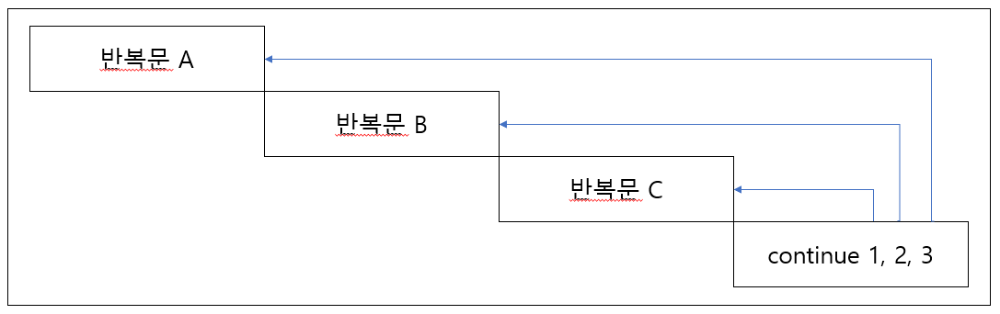

# 4장 쉘 프로그래밍 문법

**Bourne Shell(sh)의 문법을 중심으로 설명한다.**

### 4.1 쉘 프로그래밍 시작하기

- 4.1.1 쉘 스크립트의 일반적인 구조
    - 쉘 스크립트를 실행하려면 첫 라인에 `$!/bin/sh`를 입력해서 작성된 스크립트가 Bourne Shell임을 커널에게 알려주는 것으로 시작한다.
    - 다음과 같이 변수를 지정할 수 있다.
        ```sh
        string="Hello World"
        ```
    - 다음과 같이 변수를 호출할 수 있다.
        ```sh
        echo $string
        ```
    - 다음과 같이 주석 처리를 할 수 있다.
        ```sh
        # 주석입니다.
        ```
- 4.1.2 전역 변수
    - 환경 변수라고도 불린다.
    - export 명령어를 통해 환경 변수로 등록하여 마치 다른 프로그래밍 언어의 전역변수와 유사하게 사용할 수 있다.
    - 등록된 전역 변수를 확이하려면 env 또는 printevn를 이용한다.
- 4.1.3 지역 변수
    - 현재 쉘에서만 사용이 가능하다.
    - 등록된 지역변수를 확인하려면 set 명령어를 이용한다.
- 4.1.4 변수 지정하기
    - `=` 좌우에 공백이 없어야하며, 변수의 값에 공백이 있으면 "와 "를 이용하여 문자형 변수로 활용하면 된다.
    - 생성한 변수를 제거하려면 unset 명령어를 사용한다.
    - 일반적으로 변수들은 대문자로 지정한다.
    - sh의 주요 예약 변수
        - `CDPATH` : 내장 명령어인 cd 명령어를 검색하기 위해 apth로 사용되는 디렉토리 목록
        - `HOME` : 현재 사용자의 홈 디렉토리
        - `IFS` : 필드 분리자의 목차 목록으로 각 단어별로 분리할 때 사용할 필드 분리자를 지정
        - `MAIL` : 수신될 메일이 저장될 파일을 지정
        - `MAILPATH` : 메일 수신 여부를 확인하기 위한 경로를 지정
        - `PATH` : 쉘이 명령을 찾아볼 디렉토리 경로
        - `PS1` : 주 프롬프트 문자열

### 4.2 주요 문법

- 4.2.1 사용자 입력 받기 : read
    - 사용자들의 입력 사항을 받기위해 read 명령어를 이용한다.
    - `read 변수명` 형태로 사용할 수 있다.
    - `read 변수명1 변수명2` 형태로 여러 개의 변수를 입력받을 수 있다.
- 4.2.2 명령 결과 치환
    - UNIX/Linux의 명령어의 결과 값을 변수로 할당하거나 문자열로 사용하기 위한 방법으로 명령 치환이 있다.
    - \`\`를 이용하여 값을 치환할 수 있는데 명령 치환이 간단한 문법처럼 보일지 모르나 쉘 스크립트의 핵심 기능 중 하나라고 할 수 있다.
    - 출력되는 명령어를 재가공하거나 변수로 활용할 수 있으며 다른 명령어들의 처리 기능과 잘 조합하면 사용자에 최적화된 기능을 구현할 수 있다.
    - 작성 형식 : 변수명=\`명령어\`
- 4.2.3 if 문
    - 형식
        ```sh
        if 조건문
            then 명령어
                elif 조건문
                    then 명령어
            else 명령어
        fi
        ```
    - 예시
        ```sh
        #!/bin/sh

        echo -n "숫자 A를 입력하세요"
        read VAR1
        echo -n "숫자 B를 입력하세요"
        read VAR2

        if [ $VAR1 -eq $VAR2 ]
            then echo "숫자 A와 B는 같습니다."
                elif [ $VAR1 -ge $VAR2 ]
                    then echo "숫자 A는 B보다 크거나 같습니다."
                elif [ $VAR1 -le $VAR2 ]
                    then echo "숫자 A는 B보다 작거나 같습니다."
        fi
        ```
        - 개인적으로 더 보기 좋은 형태
            ```sh
            #!/bin/sh

            echo -n "숫자 A를 입력하세요"
            read VAR1
            echo -n "숫자 B를 입력하세요"
            read VAR2

            if [ $VAR1 -eq $VAR2 ]
                then echo "숫자 A와 B는 같습니다."
                elif [ $VAR1 -ge $VAR2 ]
                    then echo "숫자 A는 B보다 크거나 같습니다."
                elif [ $VAR1 -le $VAR2 ]
                    then echo "숫자 A는 B보다 작거나 같습니다."
            fi
            ```
        - 세미콜론(;)을 사용하여 한 줄에 기입할 수 있다.
            ```sh
            #!/bin/sh

            echo -n "숫자 A를 입력하세요"
            read VAR1
            echo -n "숫자 B를 입력하세요"
            read VAR2

            if [ $VAR1 -eq $VAR2 ]; then echo "숫자 A와 B는 같습니다."; elif [ $VAR1 -ge $VAR2 ]; then echo "숫자 A는 B보다 크거나 같습니다."; elif [ $VAR1 -le $VAR2 ]; then echo "숫자 A는 B보다 작거나 같습니다."; fi
            ```
- 4.2.4 test 문
    - 조건 검사의 기본인 test문
    - 사용 형태
        ```sh
        test 표현 방식
        [ 표현 방식 ]
        ```
    - 수치 비교
        - `[ $A -eq $B ]` : A와 B의 값이 같은 경우
        - `[ $A -ne $B ]` : A와 B의 값이 다를 경우
        - `[ $A -gt $B ]` : A가 B 보다 큰 경우
        - `[ $A -lt $B ]` : A가 B 보다 작은 경우
        - `[ $A -ge $B ]` : A가 B 보다 크거나 같은 경우
        - `[ $A -le $B ]` : A가 B 보다 작거나 같은 경우
    - 파일 비교
        - `[ -s ]` : 파일이 존재하면서 크기가 0보다 큰 경우
        - `[ -f ]` : 디렉토리를 제외한 파일일 경우
        - `[ -d ]` : 파일을 제외한 디렉토리일 경우
        - `[ -w ]` : 쓰기가 가능한 경우
        - `[ -r ]` : 읽기가 가능한 경우
        - `[ ! -옵션 ]` : 옵션의 조건이 거짓이 되는 경우
    - 문자열 비교
        - `[ "문자열1" = "문자열2" ]` : 두 문자열이 같은 경우
        - `[ "문자열1" != "문자열2" ]` : 두 문자열이 다른 경우
        - `[ -z "문자열" ]` : 문자열의 길이가 0인 경우
        - `[ -n "문자열" ]` : 문자열의 길이가 0이 아닌 경우
- 4.2.5 for 문
    - 사용 형식
        ```sh
        for 변수 in 원소1 원소2 원소3 ...
        do
            명령어A
        done
            명령어B
        ```
    - 예시
        ```sh
        #!/bin/sh

        for VAR in aaa bbb ccc ddd eee fff
        do
            echo $VAR
        done
            echo "^^ END"
        ```
- 4.2.6 while 문
    - while 문은 조건이 만족하면 do와 done 사이의 명령어들을 반복해 실행한다.
    - 무한 반복되는 쉘 스크립트를 종료하려면 `Ctrl + c`를 누르면 된다.
    - 사용 형식
        ```bash
        while [ 조건 ]
        do
            명령어
        done
        ```
    - 예시1
        ```bash
        #!/bin/bash

        VAR=0

        while [ $VAR -lt 10 ]
        do
            echo "$VAR"
            VAR=`expr $VAR + 1`
        done
            echo "END"
        ```
    - 예시2
        ```bash
        #!/bin/bash

        echo "지금 Shell Script 실습중입니까?(Y/N)"
        read qna

        while [[ `echo $qna | grep "^[Yy]$" | wc -l` -ne 1 ]]
        do
            echo "다시한번 생각해보세요 Shell Script 실습중입니까?(Y/N)"
            read qna
        done
            echo "열심히 하세요"
        ```
    - 예시3
        ```bash
        #!/bin/sh

        # [ 1 ] 도 똑같이 작동한다.
        while [ : ]
        do
                echo "계속 반복됩니다. 멈추려면 Ctrl + C 를 누르세요"
        done
        ```
- 4.2.7 until 문
    - until 문은 while 문과 유사항 형태로 사용할 수 있지만 while 문과는 반대로 조건문이 거짓이면 do와 done 사이의 명령어를 실행하고, 참이면 반복을 종료한다.
    - 사용 형식
        ```bash
        until [ 조건 ]
        do
            명령어
        done
        ```
    - 예시1
        ```bash
        #!/bin/bash

        echo "지금 Shell Script 실습중입니까?(Y/N)"
        read qna

        until [[ `echo $qna | grep "^[Yy]$" | wc -l` -ge 1 ]]
        do
            echo "다시한번 생각해보세요 Shell Script 실습중입니까?(Y/N)"
            read qna
        done
            echo "열심히 하세요"
        ```
    - 예시2
        ```bash
        #!/bin/bash

        until who | grep "root"
        do
            sleep 15
        done
            echo "root `date`에 로그인 되었습니다."
            echo "root `date`에 로그인 되었습니다." >> ./root.log
        ```
- 4.2.8 continue 문과 break 문
    - continue 문은 반복문 수행 중간에서 continue 이하의 내용들을 무시하고 조건 검사를 다시 진행한다.
    - break 문은 반복문을 종료하고 강제로 빠져나올 때 활용한다.
    - 예시1
        ```bash
        #!/bin/bash

        while [ 1 ]
        do
            echo "현재 사용중인 shell은? (입력 예 : sh)"
            read a

            if [ "$a" != "sh" ]
                then
                    continue
                else
                    break
            fi
        done       
        ```
    - 예시2
        ```bash
        #!/bin/bash

        for VAR in sh bash csh tcsh ksh
        do
            echo $VAR
            while [ : ]
            do
                echo -n "위의 단어를 똑같이 입력해주세요 : "
                read a
                if [ "$VAR" == "$a" ]
                    then
                        # 입력한 단어가 일치한다면 for 문으로 간다.
                        continue 2
                fi
            done
        done
        ```

        
- 4.2.9 case 문
    - 지정된 변수에 따라 사전 변수에 지정된 작업을 수행할 때 활용되며, 보톨 쉘 프로그래밍 시 메뉴를 구성할 때 많이 사용된다.
    - 기본적으로 case와 case를 뒤집어 놓은 esac 사이에 case 문을 지정된 변수에 대한 명령을 기술한다.
    - case의 각 항목을 끝낼 때는 ;;를 사용하여 패턴을 종결짓도록 한다.
    - 앞의 패턴에서 지정되지 않은 입력 값이 입력될 때는 *) 부분에 기술된 명령을 수행한다.
    - 사용 형식
        ```bash
        case 변수 in
            패턴1)
                명령어
                ;;
            패턴2)
                명령어
                ;;
            패턴3)
                명령어
                ;;
            *)
                명령어
                ;;
        esac
        ```
    - 예시
        ```bash
        #!/bin/bash

        echo -n "숫자를 입력하세요(1~3) : "
        read num

        case "$num" in
            1)
                echo "$num is one"
                ;;
            2)
                echo "$num is two"
                ;;
            3)
                echo "$num is three"
                ;;
            *)
                echo "1~3의 숫자가 아닌 숫자 또는 문자를 입력하셨군요."
                ;;
        esac
        ```
- 4.2.10 함수 만들기
    - 함수를 선언해 쉘 스크립트 내에서 호출하여 활용할 수 있다.
    - 사용 형식
        ```bash
        함수명()
        {
            명령어
        }
        ```
    - 예시
        ```bash
        #!/bin/bash

        file_cmp(){
            if [ $VAR1 -eq $VAR2 ]
                then echo "숫자 A와 B는 같습니다."
                elif [ $VAR1 -ge $VAR2 ]
                    then echo "숫자 A는 B보다 크거나 같습니다."
                elif [ $VAR2 -le $VAR2 ]
                    then echo "숫자 A는 B보다 작거나 같습니다."
            fi
        }

        echo -n "숫자 A를 입력하세요 : "
        read VAR1

        echo -n "숫자 B를 입력하세요 : "
        read VAR2

        file_cmp
        ```